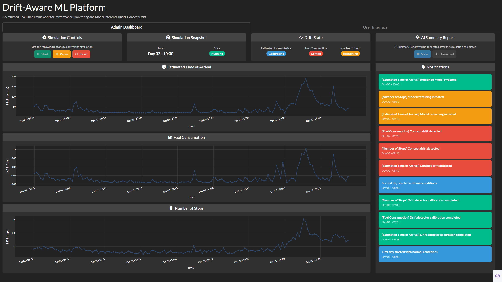
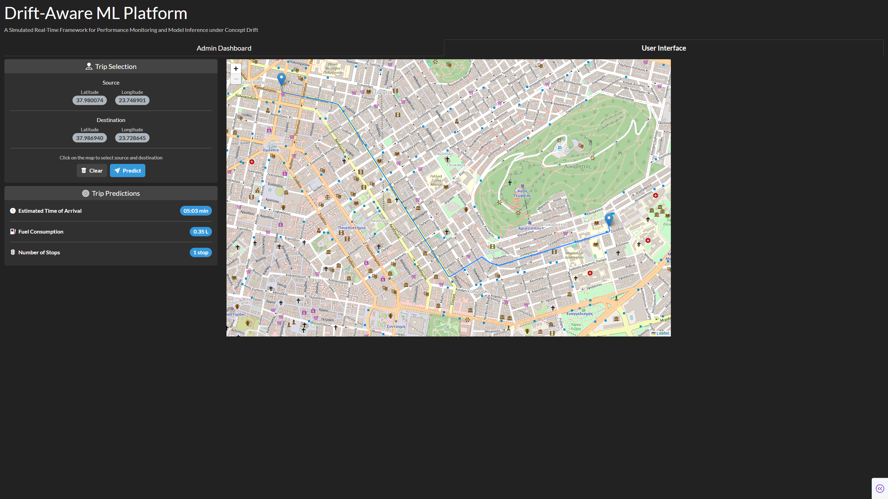
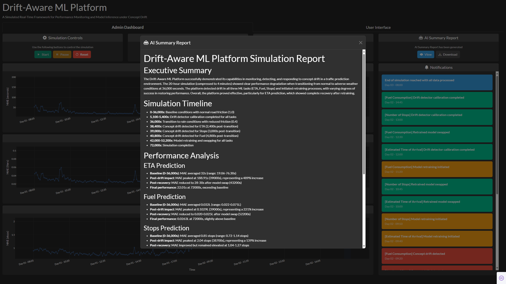
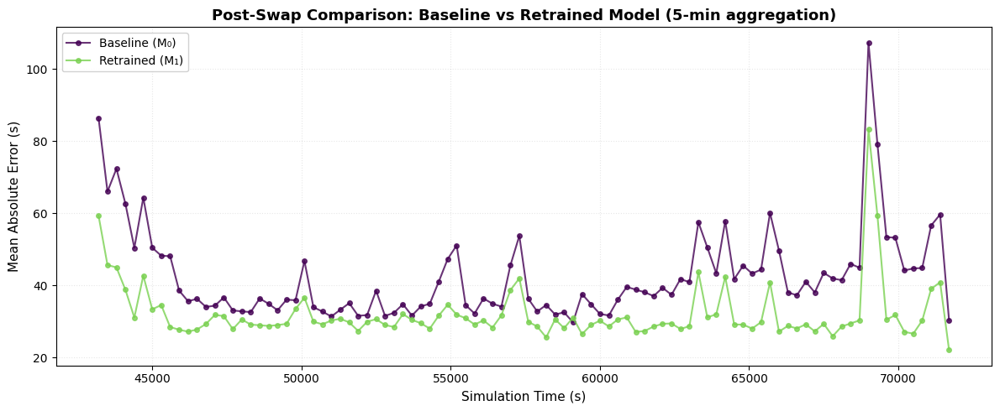
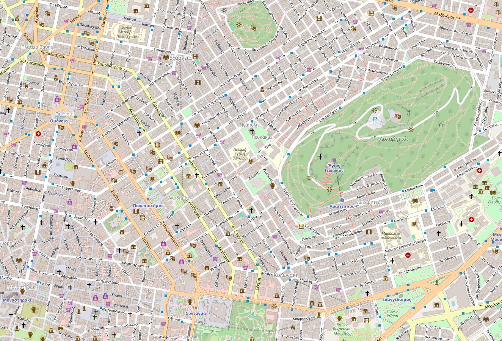
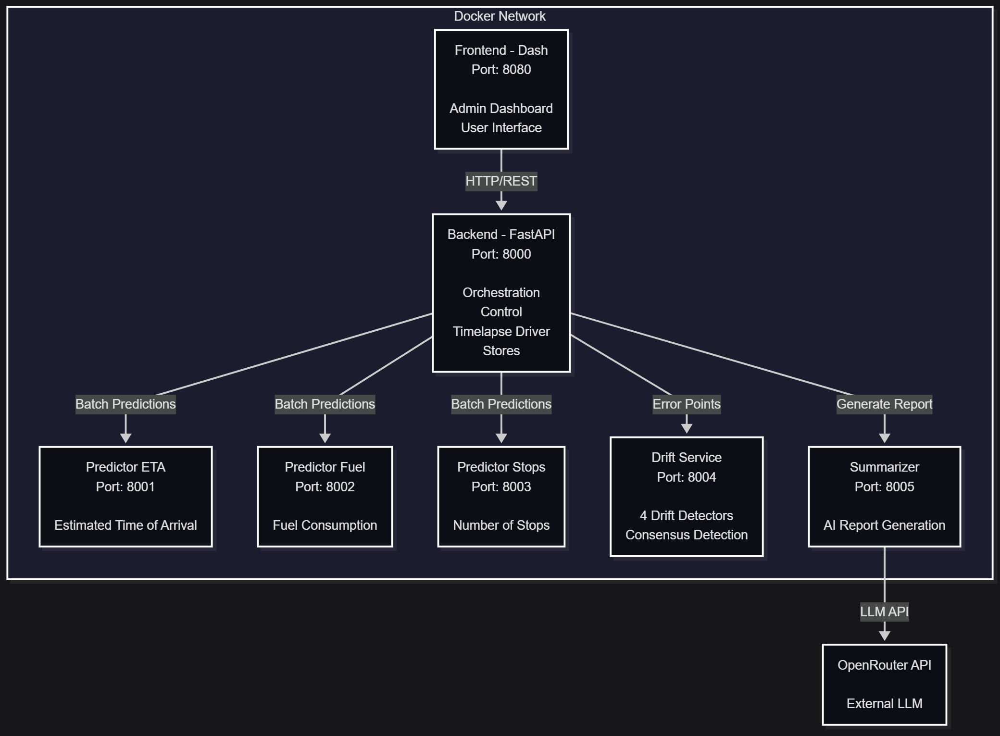

# diploma-thesis

Continuous Machine Learning for Cooperative, Connected and Automated Mobility applications for my Diploma Thesis at ECE NTUA

## Overview
This work brings together:

- A **SUMO-based synthetic traffic dataset** for central Athens (train / test / rain scenarios)
- **Machine learning research** for Estimated Time of Arrival (ETA) prediction
- A full **drift-aware ML platform** with microservices, including a dashboard for monitoring, automated drift detection and adaptation, and support for multiple models

The **dataset** used in this work is publicly available on Zenodo, under the DOI [10.5281/zenodo.16950674](https://zenodo.org/records/16950674).

For convenience, the repository also includes the three preprocessed parquet inputs, derived from the dataset above and used by the platform, under [appdata/data](appdata/data).

The accompanying [report](report/main.pdf) and [presentation](presentation/main.pdf) can be viewed for more details.

The repo is structured as a **monorepo**: dataset generation, ML experiments, platform code, and LaTeX sources for the report and presentation all live here.

## Contributions
This diploma thesis includes contributions by **Georgios Angelis** and **Serafeim Tzelepis**.

The platform's conceptualization was a joint effort. The Fuel Consumption model was implemented by Georgios Angelis, while the Number of Stops model was implemented by Serafeim Tzelepis. Parts of the platform are also based on their work, including the Drift service (Serafeim Tzelepis) and the Summarizer service (Georgios Angelis).

## The Drift-Aware ML Platform

The core focus of this work is an end-to-end platform for deploying, monitoring, and maintaining machine learning models in dynamic environments. It detects concept drift in real-time, automatically retrains models upon performance degradation, and smoothly hot-swaps them, all while providing comprehensive analytics and LLM-generated incident reports to administrators.

### Admin Dashboard
The platform provides a comprehensive administrative dashboard to monitor streaming predictions, actively detect data drift, and examine automated model swap processes. It also displays the real-time health and metadata for every deployed model.



### User Interface
A client interface is provided for users to interact directly with the active models. It serves as a practical tool to specify trip details and receive immediate predictions for ETA, fuel consumption, and number of stops, enabling users to explore and study the models' behavior on the fly.



### Automated AI Reporting
At the end of the simulation, the platform generates automated LLM-based summary reports. These reports evaluate the newly trained components and succinctly explain the performance changes that occurred during the run for the administrators.



### Model Adaptation Effectiveness
To showcase the effectiveness of the platform's retraining process, the following comparison illustrates predictive performance before and after a model swap. It demonstrates how the new model successfully adapts to the shifted data distribution.



## Quick Start
This project supports two main workflows:

1. **Dataset Generation & Machine Learning Research** - For running the dataset generation simulation and machine learning research experiments
2. **Platform** - For running the full Drift-Aware ML Platform

### Dataset Generation & Machine Learning Research



Use `uv` to manage dependencies and create isolated environments.

#### Install uv
```powershell
# Windows
powershell -ExecutionPolicy ByPass -c "irm https://astral.sh/uv/install.ps1 | iex"
```

```bash
# Linux/MacOS
curl -LsSf https://astral.sh/uv/install.sh | sh
```

#### Clone and install dependencies
```bash
git clone https://github.com/geokyr/diploma-thesis
cd diploma-thesis
```

Install specific dependency groups based on your needs, for example:

```bash
# For dataset generation
uv sync --extra simulation

# For ML research experiments
uv sync --extra eta

# For all dependencies
uv sync --all-extras
```

#### Running Scripts
All scripts should be invoked via `uv run` to use the correct virtual environment.

```bash
# Run the dataset generation simulation
uv run simulation/simulation.py

# Run the baseline research experiment
uv run experiments/baseline_research.py
```

### Platform



Use Docker Compose to run the Drift-Aware ML Platform, which consists of the following services:
- **Backend** (port 8000) - Main orchestration and control service
- **Predictor** (ports 8001, 8002, 8003) - ETA, Fuel, and Stops prediction services
- **Drift** (port 8004) - Concept drift detection service
- **Summarizer** (port 8005) - LLM summarization service
- **Frontend** (port 8080) - Admin Dashboard and User Interface

#### Prerequisites
- Docker and Docker Compose installed
- API key for OpenRouter, used in the summarizer service (*free models are used, so no charges are incurred*)

#### Configuration
Create a `.env` file in the project root with your API key:

```bash
OPENROUTER_API_KEY=your_api_key_here
```

Docker Compose will automatically load environment variables from this file.

If you prefer not to keep the raw `.env` locally, store the OpenRouter key in your GitHub repository secrets for CI usage or keep it in a password manager, then recreate `.env` when running the platform locally.

#### Production Mode
```bash
# Start all services
docker compose up -d

# View logs
docker compose logs -f

# Stop all services
docker compose down
```

Access the platform running locally at `http://localhost:8080`.

#### Development Mode
For development with hot-reload (code changes reflected immediately):

```bash
# Start services with dev configuration
docker compose -f docker-compose.yml -f docker-compose.dev.yml up -d

# View logs
docker compose logs -f

# Stop all services
docker compose down
```

Development mode mounts your local `thesis/` directory into containers, allowing you to modify code without rebuilding images.

## Repository Structure
- `appdata/` - Platform artifacts and generated inputs
  - `appdata/data/` - Preprocessed parquet inputs used by the platform runtime
- `docs/` - Documentation for the project
- `experiments/` - Machine learning research experiments
- `outputs/` - Outputs from the experiments (models, metrics, logs)
- `presentation/` - Presentation in LaTeX
- `report/` - Report in LaTeX
- `simulation/` - SUMO configuration files and datasets
- `thesis/` - Python package including all the project code
  - `backend/` - Main orchestrator and control service
  - `common/` - Shared modules and configuration
  - `drift/` - Concept drift detection service
  - `eta/` - ETA prediction task
  - `frontend/` - Admin Dashboard and User Interface
  - `fuel/` - Fuel consumption prediction task
  - `predictor/` - Model prediction services
  - `simulation/` - Dataset generation simulation with SUMO
  - `stops/` - Number of stops prediction task
  - `summarizer/` - LLM summarization service

## Future Work
The following areas have been identified for future code quality improvements:
- **Config**: Solidify configuration management and validation.
- **Logging**: Enhance log coverage and formatting.
- **Error Handling**: Implement robust explicit error handling for API endpoints.
- **Testing**: Establish a comprehensive testing suite using `pytest`.
