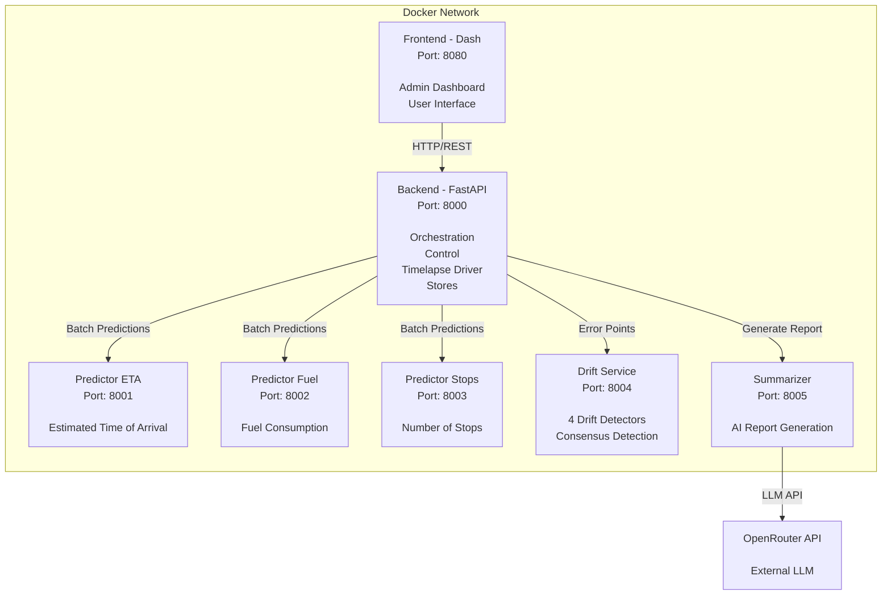
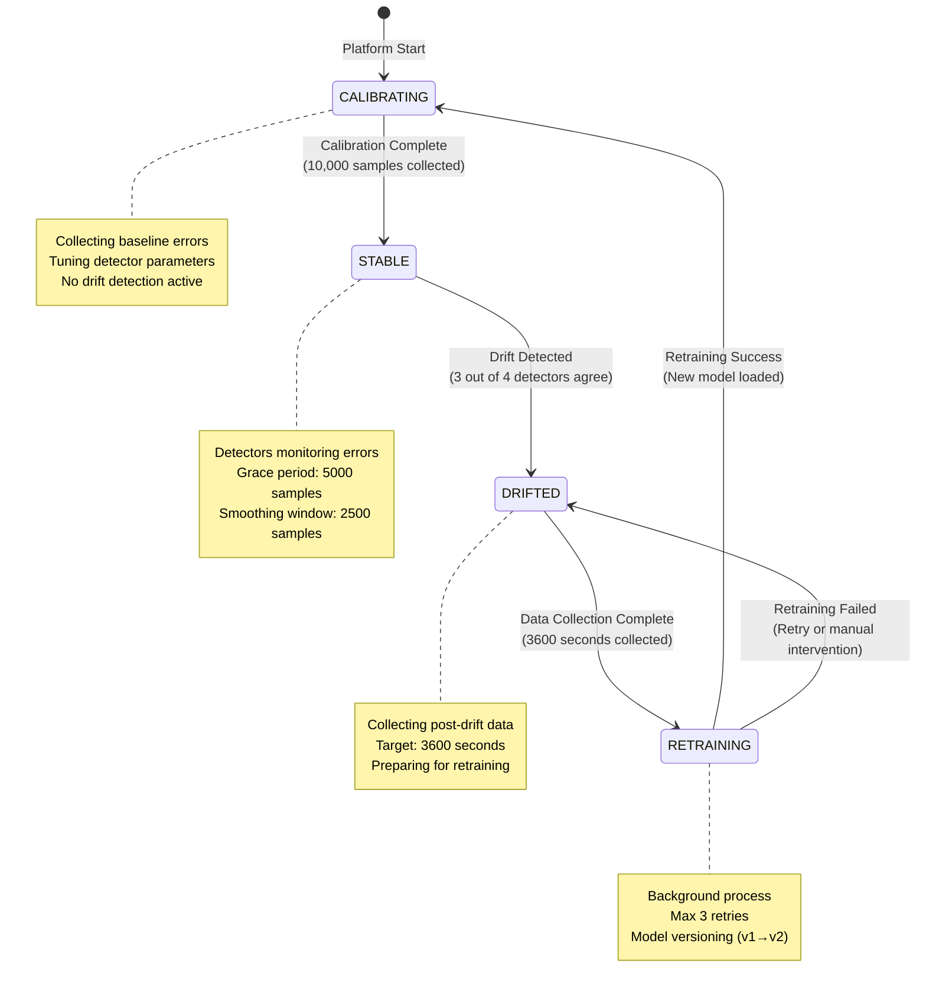

# Platform

## Table of Contents

- [Executive Summary](#executive-summary)
- [System Architecture](#system-architecture)
- [Deployment Architecture](#deployment-architecture)
- [Cross-Cutting Architecture Qualities](#cross-cutting-architecture-qualities)
- [Performance Goals and Achievements](#performance-goals-and-achievements)
- [Platform Capabilities Summary](#platform-capabilities-summary)
- [Architectural Trade-offs](#architectural-trade-offs)
- [API Endpoints Reference](#api-endpoints-reference)

## Executive Summary
The **Drift-Aware ML Platform** is a comprehensive, microservice-based system designed for real-time monitoring, concept drift detection, and adaptive model retraining in machine learning applications. Built specifically for traffic prediction scenarios, the platform demonstrates a production-ready architecture that seamlessly integrates multiple ML models, continuous performance monitoring, automated drift detection, and intelligent model adaptation.

The platform operates as a simulated real-time framework where:
- **Three independent ML prediction services** provide estimates for different traffic metrics (ETA, fuel consumption, number of stops)
- **A consensus-based drift detection service** monitors model performance degradation using four complementary algorithms
- **An intelligent retraining pipeline** automatically collects data, retrains models, and hot-swaps them into production
- **A comprehensive web-based frontend** provides both administrative monitoring and end-user prediction interfaces
- **An AI-powered summarization service** generates analytical reports of platform behavior
- **A 20-hour simulation** of traffic data is compressed into approximately 4-5 minutes of simulated time for demonstration purposes

## System Architecture

### High-Level Design
The platform follows a **microservices architecture** with six independent services communicating via HTTP/REST APIs:



### Service Responsibilities

#### Backend Service (Port 8000)
**Role**: Central orchestration, simulation control, and state management

**Key Components**:
- **TimelapseDriver**: Drives the simulation forward, manages time progression (300x speed multiplier), coordinates prediction windows, triggers drift detection, and manages model retraining lifecycle
- **SimulationManager**: Controls simulation state (Ready/Running/Paused/Completed), manages async tick loop, coordinates report generation at the end of the simulation
- **MetricsStore**: In-memory circular buffer (deque) storing performance metrics (MAE) for each ML task with configurable max length (1000 points) with fast append and retrieval
- **NotificationStore**: In-memory circular buffer storing platform events (drift detection, retraining, model swaps) with timestamps and different levels of severity (INFO, SUCCESS, WARNING, DANGER)
- **ReportStore**: Manages AI-generated summary report state (Not Started/Generating/Ready/Failed) and the content of the report
- **PredictionService**: Handles user-initiated single trip predictions by routing requests to appropriate predictor services

**Design Patterns**:
- **Abstraction**: Backend is completely agnostic to ML task specifics; it only requests predictions for timestamp windows
- **Async/Await**: All I/O operations use async patterns for high concurrency
- **Graceful Degradation**: Failed requests to downstream services don't crash the backend
- **Dynamic Service Discovery**: At startup, the backend detects which predictor services are available by performing parallel health checks on all potential ML tasks, and the platform adapts to only the available predictors without requiring hardcoded service configurations, enabling flexible deployment where not all predictors need to be running

#### Predictor Services (Ports 8001-8003)
**Role**: Model inference, feature engineering, and background retraining

**Three Independent Instances**:
- **predictor-eta**: Predicts trip duration (seconds)
- **predictor-fuel**: Predicts fuel consumption (liters)
- **predictor-stops**: Predicts number of stops during trips

**Key Components**:
- **ModelManager**: Simple versioning system for models (v1, v2, ...), loads models from `appdata/models/{task}/{version}/`, manages metadata and hot-swapping
- **DataLoader**: Time-window based data loading from Parquet files and fast timestamp-based filtering without loading the full dataset
- **Predictor**: Performs batch predictions on time windows and single predictions with feature calibration and calculates all absolute errors
- **FeatureCalibrator**: Task-specific feature engineering (temporal, spatial, fourier, clustering) loaded from precomputed artifacts calibrated on training data for each task, used for on-the-fly feature engineering for single predictions
- **RetrainService**: Background job management using `ProcessPoolExecutor` (1 worker) with retry logic (max 3 retries) and dynamic model sizing based on the available data
- **SumoService**: Interface with SUMO network for route computation and feature extraction with `sumolib`, used for route preview in the frontend and for single predictions feature extraction

**Architecture Highlights**:
- **Model Registry Pattern**: Models stored in versioned directories with metadata JSON files
- **Feature Precomputation**: Most features are precomputed and stored in Parquet files; FeatureCalibrator allows on-the-fly computation for single predictions
- **Background Processing**: Retraining jobs run in separate processes to avoid blocking prediction serving
- **Retry Logic**: Failed retraining jobs automatically retry up to 3 times before marking as failed
- **Dynamic Model Sizing**: Retrained models use a formula to adjust the added number of trees in the model based on the available data

#### Drift Detection Service (Port 8004)
**Role**: Online concept drift detection using consensus-based approach

**Key Components**:
- **DriftService**: Routes error batches to task-specific workers
- **DriftWorker**: One dedicated process per ML task for isolated state management
- **Drift Detectors**: Four complementary algorithms from River library
  - **ADWIN** (Adaptive Windowing): Detects changes in distribution mean
  - **Page-Hinkley**: Detects upward trends in cumulative error
  - **KSWIN** (Kolmogorov-Smirnov Windowing): Statistical test for distribution changes
  - **SPC** (Statistical Process Control): Threshold-based consecutive violation detection

**Consensus Mechanism**:
- Drift is triggered when **at least 3 out of 4 detectors agree** (configurable threshold)
- Detectors operate on smoothed errors with 2500 samples rolling mean and fast O(1) computation
- Each detector has a grace period (5000 samples) before activating

**Calibration Process**:
- Platform starts in **CALIBRATING** state
- Collects 10,000 error samples from baseline data
- Automatically tunes detector hyperparameters by iterating through candidate values and selecting parameters that avoid false positives on baseline data
- Transitions to **STABLE** state when calibration completes
- After drift detection and model retraining, detectors recalibrate

**State Transition Diagram**:



**Worker Architecture**:
- Each ML task has a dedicated `DriftWorker` running in a separate process
- Uses multiprocessing queues for request/response communication
- Maintains isolated state (detector instances, calibration errors, sample counts)
- Prevents blocking of the main thread of the drift service between different ML tasks

#### Frontend Service (Port 8080)
**Role**: Web-based UI for monitoring and user interaction

**Technology Stack**:
- **Plotly Dash**: Python-based web framework
- **Dash Bootstrap Components**: Modern UI components
- **Dash Leaflet**: Interactive map integration with OpenStreetMap tiles

**Two Main Interfaces**:

- **Admin Dashboard**:
  - Simulation controls (Start/Pause/Resume/Reset)
  - Real-time metrics charts (MAE over time for each ML task)
  - Drift state indicators (Calibrating/Stable/Drifted/Retraining)
  - Chronological notification feed
  - AI-generated summary report viewer and PDF download at the end of the simulation

- **User Interface**:
  - Interactive map (OpenStreetMap tiles) for source/destination selection
  - Click-based trip specification
  - Route preview using the SUMO network and `sumolib`
  - Real-time predictions from all available ML models

**State Management**:
- **dcc.Store** components for client-side state (snapshot, ML tasks, user map coordinates selection, route preview features, notifications, report)
- **dcc.Interval** components for periodic polling (bootstrap, simulation tick, report status)
- **Pattern-Matching Callbacks**: Dynamic UI generation based on available ML tasks using MATCH dependencies
- **Event-Driven Architecture**: Button clicks trigger events stored in event-store, processed by central handler

**Callback Categories**:
- **Simulation Callbacks**: Bootstrap for initial state fetch and ML tasks detection, tick loop for real-time state updates, button handlers for simulation control, state updates for the UI
- **Monitoring Callbacks**: Dynamic card/status rendering based on available ML tasks, drift state updates, chart updates for the real-time metrics, drift detection window highlighting for the MAE charts
- **Notification Callbacks**: Feed updates based on the notification store, alert rendering based on the notification level
- **Map Callbacks**: Coordinate extraction from the map, marker placement and route rendering based on the route preview features
- **Report Callbacks**: Modal display on button click, PDF generation when requested for download, status polling after end of simulation

#### Summarizer Service (Port 8005)
**Role**: AI-powered analysis and report generation

**Integration**:
- Uses **OpenRouter API** (compatible with OpenAI client) to access LLM models
- Configured to use free models (no charges incurred)
- Receives notification feed and metrics from backend after simulation completion

**Report Generation Process**:
- Backend detects simulation completion
- Collects all notifications and metrics from stores
- Sends request to summarizer with formatted and structured JSON data
- LLM analyzes data using detailed system prompt
- Generates comprehensive markdown report covering:
  - Executive summary
  - Timeline of major events
  - Performance analysis per ML task
  - Drift detection effectiveness
  - Model retraining and recovery assessment
  - Insights and recommendations

**Error Handling**:
- Retry logic with exponential backoff (max 3 retries)
- Async client with configurable timeout (180 seconds)
- Artifact cleaning to remove LLM special tokens

### Technology Stack
**Infrastructure**:
- **Docker**: Containerization
- **Docker Compose**: Multi-container orchestration
- **uv**: Python package and project management

**Programming Languages & Frameworks**:
- **Python 3.12**: Core language for all services
- **FastAPI**: REST API framework for backend, predictors, drift, and summarizer
- **Plotly Dash**: Web framework for frontend
- **Uvicorn**: ASGI server for FastAPI services
- **uvloop**: High-performance event loop (Linux/Mac)
- **httptools**: Fast HTTP parsing

**Machine Learning**:
- **scikit-learn**: ML pipeline and preprocessing
- **LightGBM**: Primary gradient boosting framework
- **XGBoost**: Alternative gradient boosting framework
- **River**: Online learning and drift detection algorithms

**Data Management**:
- **Pandas**: Data manipulation and analysis
- **NumPy**: Numerical operations
- **PyArrow**: Efficient Parquet reading with timestamp filtering

**Communication**:
- **httpx**: Async HTTP client for inter-service communication
- **Pydantic**: Data validation and serialization
- **ORJSONResponse**: Fast JSON serialization for API responses

**Frontend**:
- **Dash**: Web framework
- **Dash Bootstrap Components**: UI components
- **Dash Leaflet**: Interactive maps
- **Plotly**: Data visualization
- **Markdown**: Markdown rendering
- **xhtml2pdf**: PDF generation

**Summarizer**:
- **OpenAI**: Client for the LLM API

### Data Flow

#### Simulation Tick Flow
- **TimelapseDriver.run_tick()** advances clock by `interval_seconds * speed_multiplier` (1 second * 300 = 5 simulated minutes)

- **Parallel Prediction Requests**: Backend sends concurrent requests to all predictor services for the time window

- **Predictor Processing**:
   ```
   DataLoader → Load window → FeatureEngineering → Model.predict() → Compute MAE
   ```

- **Drift Detection**: For each ML task with predictions:
   ```
   Error Points → DriftWorker → Process through detectors → Return state
   ```

- **State Updates**:
  - MetricsStore receives (timestamp, MAE, n_samples)
  - DriftInfo updated based on detector responses
  - State transitions handled: CALIBRATING → STABLE → DRIFTED → RETRAINING

- **Retraining Trigger**:
  - When drift detected, platform starts collecting data
  - After 3600 seconds (1 hour) of collection:
    - Submit retraining job to predictor's ProcessPoolExecutor
    - Job runs in background process
    - On completion, ModelManager loads new version
    - Drift detectors recalibrate

- **Frontend Update**:
  - Interval callback fires
  - Fetches latest snapshot from backend
  - Updates UI components via pattern-matching callbacks
  - Charts re-render with new metrics

#### User Prediction Flow
- User clicks map to select source/destination
- Frontend sends route preview request to any predictor
- Predictor uses SumoService to compute shortest path
- Frontend renders route polyline on map
- User clicks "Predict" button
- Backend.PredictionService sends parallel requests to all predictors
- Each predictor:
  - Uses FeatureCalibrator to transform input (on-the-fly feature engineering)
  - Runs inference with current model
  - Returns prediction value
- Frontend displays predictions for all ML tasks

## Deployment Architecture

### Docker Compose Orchestration
The platform uses **Docker Compose** for multi-container orchestration, providing several key benefits:

- **Service Isolation** - Each component runs in its own container with independent lifecycle management
- **Dependency Management** - Automatic startup ordering based on health checks ensures services start in the correct sequence
- **Network Isolation** - All services communicate via an internal Docker network, improving security
- **Volume Management** - Shared data directories for models, logs, and artifacts across containers

**Deployment Command**:

To deploy the platform in production mode, a single command starts all services: `docker compose up -d`. This triggers the following sequence:

- Docker builds images for each service if not already built
- Creates an internal network for service communication
- Starts services in dependency order:
  - Drift service and all three predictor services start first
  - Backend waits for drift and all predictors to report healthy status
  - Summarizer starts independently in parallel
  - Frontend waits for backend to be healthy before starting
- All services run in detached mode, continuing in the background

**Service Environment Variables**:

Each service in the Docker Compose file includes a few important environment variables:
- `SERVICE` identifies which service to run (backend, predictor-eta, predictor-fuel, predictor-stops, drift, summarizer, frontend)
- `APP_DIR` specifies the path to application data directory
- `ENVIRONMENT` toggles between development and production mode
- `OPENROUTER_API_KEY` loaded from `.env` file for the summarizer service to access the OpenRouter API

**Volume Mount Structure**:

The `appdata/` directory serves as the central data repository, organized into subdirectories with specific access patterns:

- **`common/`** - SUMO network data shared across all services (read-only access)
- **`data/`** - Training and test datasets for each ML task (predictor services only, read-only)
- **`models/`** - Model registry with versioned artifacts and metadata (predictor services, read-write)
- **`misc/`** - Precomputed feature engineering artifacts and calibrators (predictor services, read-only)
- **`logs/`** - Service-specific log files with rotation (all services, read-write to own subdirectory)

**Development Mode**:

For development purposes, an override file (`docker-compose.dev.yml`) can be used alongside the base configuration. This adds hot-reload capabilities by mounting the local source directory into containers, enabling code changes to take effect immediately without rebuilding images. The `ENVIRONMENT` variable is set to `development` to enable auto-reload in FastAPI services.

**Network Configuration**:

Docker Compose automatically creates an internal network for inter-service communication. Services communicate using service names as hostnames (e.g., backend reaches the ETA predictor at `http://predictor-eta:8001`). For security in production deployments, only the frontend port (8080) needs external exposure for user access. The current configuration exposes all service ports for demonstration and debugging purposes, but production deployments should restrict external access to only the frontend.

**Port Assignments**:
- `8000`: Backend
- `8001`: Predictor ETA
- `8002`: Predictor Fuel
- `8003`: Predictor Stops
- `8004`: Drift Detection
- `8005`: Summarizer
- `8080`: Frontend

### Docker Image Architecture
All services use a similar Dockerfile structure with service-specific customizations. This approach maximizes consistency while allowing targeted optimization for each component.

**Key Design Decisions**:

- **Slim Base Image** - Uses `python:3.12-slim` to minimize image size and attack surface
- **Layer Caching** - Dependencies are installed before copying application code, enabling faster rebuilds when only code changes
- **uv Package Manager** - Leverages the modern Rust-based uv package manager for fast, deterministic dependency resolution
- **Service-Specific Dependencies** - Each Dockerfile installs only its required dependency group (e.g., `thesis[drift]`, `thesis[predictor]`)
- **Health Check Support** - Includes `curl` utility for Docker health check commands

**Image Sizes**:
- **Predictor Services**: ~2.1 GB (includes heavy ML libraries like LightGBM, XGBoost, scikit-learn)
- **Drift Service**: ~580 MB (River library and minimal dependencies)
- **Frontend Service**: ~570 MB (Dash, Plotly, and visualization libraries)
- **Summarizer Service**: ~450 MB (OpenAI client and API dependencies)
- **Backend Service**: ~450 MB (FastAPI, httpx, and coordination logic)

The predictor services are significantly larger due to the inclusion of multiple gradient boosting frameworks and their dependencies, while other services remain relatively lightweight.

### Resource Requirements
- **Minimum**: 4 CPU cores, 8 GB RAM, 10 GB disk (thesis demonstration)
- **Recommended**: 8+ CPU cores, 16 GB RAM, 20 GB disk (development and experimentation)
- **Production**: 16+ CPU cores, 32 GB RAM, 100 GB disk (concurrent users and scaled deployment)

Predictor services consume the most resources due to ML model inference, while other services remain lightweight. For scaling, deploy multiple predictor replicas behind a load balancer (horizontal) or increase RAM for larger models (vertical).

### Configuration Management
**Centralized Configuration**:

The platform uses a single, centralized YAML configuration file that defines all system parameters. This configuration is loaded once at import time and accessed throughout the codebase.

**Key Configuration Categories**:

- **Logging**: File rotation settings (max size 10MB, 5 backups)

- **Services**: Host, ports, environment, event loop (uvloop), HTTP server (httptools)

- **Simulation/Timelapse**:
  - Speed multiplier: 300x
  - Interval: 1 second real-time = 5 minutes simulation time
  - Collection period: 3600 seconds (1 hour) after drift detection

- **Drift Detection**:
  - Smoothing window: 2500 samples
  - Grace period: 5000 samples
  - Calibration window: 10,000 samples
  - Consensus threshold: 3 out of 4 detectors
  - Detector hyperparameter candidate lists

- **Model Retraining**:
  - Max workers: 1 (ProcessPoolExecutor)
  - Max retries: 3
  - Training samples: 53,229 for the ETA task
  - Shrink factor: 0.5 for the retraining of models

- **ML Tasks**:
  - Task-specific column names for the prediction tasks
  - Task-specific parameters (e.g., ETA min duration: 30s, min distance: 200m)

- **Feature Engineering**: Parameters for temporal, spatial, Fourier, clustering, and PCA features for the prediction tasks

- **Summarizer**:
  - OpenRouter API base URL and model selection
  - System prompt defining the report structure and guidelines
  - Retry logic and timeout settings

**Service-Specific Configuration**:

`PlatformServiceConfig` class provides service-aware paths and URLs:
- Automatically determines service type from `SERVICE` environment variable
- Constructs ML task-specific paths (e.g., `models_dir` points to `appdata/models/eta` for ETA predictor)
- Provides URLs for inter-service communication (e.g., `backend_url`, `drift_url`)
- Creates required directories on initialization

### Dependency Management
**uv**:
- Modern, fast Python package manager (Rust-based)
- Lockfile-based dependency resolution (`uv.lock`)
- Optional dependency groups for modular installation

**Dependency Groups** (`pyproject.toml`):

The project uses optional dependency groups to minimize container sizes and install only required packages per service. Listed below are some examples for each dependency group:

- **`api`** - Common API dependencies: `fastapi`, `uvicorn`, `pydantic`
- **`backend`** - Backend-specific: `httpx`, `numpy`, `thesis[api]`
- **`drift`** - Drift detection: `river`, `numpy`, `thesis[api]`
- **`eta`** - ETA prediction task: `requests`, `thesis[research]`, `thesis[sumo]`
- **`frontend`** - Web interface: `dash`, `dash-bootstrap-components`, `plotly`
- **`predictor`** - Predictor-specific: `thesis[api]`, `thesis[research]`, `thesis[sumo]`
- **`research`** - ML development: `lightgbm`, `xgboost`, `catboost`
- **`simulation`** - Dataset generation: `eclipse-sumo`, `numpy`, `thesis[sumo]`
- **`summarizer`** - Report generation: `openai`, `thesis[api]`
- **`sumo`** - SUMO network integration: `pyproj`, `rtree`, `sumolib`

Each container installs only its required dependency group (e.g., the drift container installs `thesis[drift]` with `river` and API dependencies, but not the heavy ML libraries).

This modular approach allows:
- Installing only required dependencies for each service
- Sharing common dependencies via dependency groups (e.g., `thesis[api]`)
- Separate research/development environment from production services

### Production Considerations
The current platform implementation prioritizes functional architecture and core ML operations for thesis demonstration. However, several enhancements would be critical for production deployment:

**Performance Optimization**:
- **Caching Strategies** - Implement model caching at proxy level using Redis to reduce repeated loads
- **Connection Pooling** - Add connection pooling for httpx clients to reuse connections across requests

**Monitoring and Observability**:
- **Metrics Collection** - Integrate Prometheus for collecting system metrics (prediction duration, drift detections, API request rates, error counts)
- **Distributed Tracing** - Add OpenTelemetry instrumentation to track requests across services and identify bottlenecks
- **Log Aggregation** - Implement centralized logging with ELK stack (Elasticsearch, Logstash, Kibana) or Grafana Loki for structured log analysis

**Security Enhancements**:

The current security posture relies on internal Docker networking and exposes services for demonstration purposes. Production deployment requires additional hardening:

- **Network Isolation** - Current configuration uses internal Docker network, which provides basic isolation. Only frontend port (8080) should be exposed externally in production
- **Authentication** - Implement API key authentication for service endpoints using FastAPI security utilities
- **HTTPS/TLS** - Add reverse proxy (Nginx) with SSL certificates for encrypted communication
- **Rate Limiting** - Implement per-endpoint rate limiting to prevent abuse and ensure fair resource allocation
- **Secrets Management** - Replace environment variables with Docker secrets for sensitive data like API keys

### Extensibility and Customization
The platform architecture supports several extension patterns for adapting to new requirements:

**Adding New ML Tasks**:

The platform can accommodate additional prediction tasks with minimal changes. The process involves preparing training data in Parquet format, training an initial model and saving it to the model registry, creating a task-specific FeatureCalibrator fitted on training data, updating configuration with the new task's parameters, adding the task to the MLTask enum, updating predictor service mappings for target columns and calibrator classes, and deploying a new predictor container via Docker Compose. The backend automatically discovers the new service through health checks at startup.

**Customizing Drift Detection**:

Drift detection behavior can be tuned through configuration parameters without code changes. The consensus threshold (default 3 out of 4 detectors) controls sensitivity—lowering it increases sensitivity with more false positives, while raising it makes detection more conservative. The calibration window size (default 10,000 samples) affects tuning accuracy versus calibration time. The grace period (default 5,000 samples) determines how soon detection can trigger after startup.

Adding new drift detectors requires implementing a detector class with update logic, creating a calibration function to tune parameters, updating the calibration computation to include the new detector, modifying detector creation to instantiate it, and adjusting the consensus threshold to account for the additional detector.

**Customizing Frontend**:

The Dash-based frontend supports visual customization through theme changes (Bootstrap themes like CYBORG, DARKLY, SLATE), adding new visualization components with Plotly graphs, modifying notification levels and colors, and creating custom callbacks for new data displays. The pattern-matching callback system enables dynamic UI generation based on available ML tasks.

## Cross-Cutting Architecture Qualities

### Extensibility Patterns
The backend remains **ML-task agnostic**: it requests predictions for timestamp windows, stores only error/MAE points, and initiates retraining from drift signals without ever decoding task-specific features. That abstraction allows teams to add new predictors, swap models in the registry, or adjust feature engineering without touching backend code.

All predictor services share a single codebase whose behaviour is resolved at runtime. The `SERVICE` environment variable and derived `ml_task` drive task-specific lookup tables, FeatureCalibrator classes, and column mappings. This pattern keeps configuration-driven differences close to the code that needs them while reusing the same deployment artefact across eta, fuel, and stops.

Feature engineering balances performance and flexibility. Batch inference pulls Parquet datasets with precomputed features so each 5-minute window is processed in well under a second. Single predictions invoke task-specific FeatureCalibrator artefacts that rebuild temporal, spatial, Fourier, and clustering features from raw coordinates and timestamps. Moving batch workloads onto the calibrators is the next evolution toward online learning because it would eliminate the dependency on pre-generated datasets.

`DataLoader` offers a narrow interface—load data between two timestamps—and currently backs that contract with local Parquet filtering. Because callers never see the storage implementation, the same interface can hang off TimescaleDB queries, Kafka subscriptions, cloud object storage, or streaming APIs as requirements change.

Each task keeps its models in `appdata/models/{ml_task}/vN` directories containing a `model.joblib` artefact and a `metadata.json` descriptor. Metadata records lineage (base version), hyperparameters, training windows, and model types. The `ModelManager` helper loads specific versions, persists new releases with auto-incrementing IDs, and preserves older versions for rollback or A/B experimentation.

### Shared Service Foundations
`PlatformServiceConfig` (located in `thesis/common/service.py`) standardises how services derive their identity, construct filesystem paths, and resolve URLs for peer communication across development and production environments. FastAPI applications share unified scaffolding: lifespan context managers coordinate startup/shutdown work, ORJSON handles high-performance serialisation, and `/health` endpoints expose status for Docker health checks and external monitors.

Pydantic models form the common language between services. Schemas such as `SimulationSnapshot`, `DriftInfo`, `MetricPoint`, `Notification`, and `HealthResponse` guarantee typed contracts, simplify validation, and drive the generated OpenAPI documentation. Combined with centralised dependency declarations (via uv dependency groups) and configuration management, these foundations keep maintenance predictable as the codebase grows.

State management also follows a consistent pattern: the backend owns authoritative in-memory stores for metrics, drift information, notifications, and report content. The frontend polls those endpoints and applies optimistic UI updates so user actions feel immediate while reconciliation happens against backend truth. Predictor services remain stateless aside from their loaded model versions, which keeps scaling and restarts straightforward.

### Observability and Diagnostics
Logging is set up centrally through `thesis/common/logger.py`, producing service-specific log files under `appdata/logs/{service}/` with rotation capped at 10MB and five backups. While the thesis deployment leans on these rotating files, the architecture anticipates production upgrades such as JSON-formatted structured logs, aggregation pipelines (ELK, Loki), and distributed tracing via OpenTelemetry.

Error handling follows a graceful degradation philosophy. Critical integration points wrap requests in protective try/except blocks so transient failures bubble up as notifications rather than crashes. Planned improvements include richer alerting, error monitoring, and automated testing coverage (unit, integration, performance, and end-to-end) beyond the functional checks used during development.

### Resilience and Concurrency
Graceful degradation, retry logic, and health probes combine to keep faults localised. Should a predictor or summarizer stumble, the backend records the issue, exposes it through notifications, and carries on with the simulation loop. Docker health checks restart unhealthy containers, and stateless service design keeps recovery simple.

Concurrency is achieved through layered techniques. The backend exploits `asyncio.gather` and `httpx.AsyncClient` for non-blocking network calls so each simulation tick can fan out to multiple services without additional threads. Long-running tasks, such as retraining job monitoring, are dispatched via `asyncio.create_task` to keep the main loop responsive. CPU-bound work is isolated with multiprocessing: per-task drift workers execute detectors in their own processes, and each predictor relies on a single-worker `ProcessPoolExecutor` to train models without starving inference requests.

## Performance Goals and Achievements

The platform was designed with a primary goal: **simulate 72,000 seconds (20 hours) of traffic data in approximately 4-5 minutes**, achieving a 300x speed multiplier. This ambitious target drove several architectural decisions and required strategic compromises.

### Key Architectural Compromises
Hitting the 300x target meant leaning on three trade-offs explored in detail later: precomputing batch features to avoid heavy runtime transforms, keeping operational state in memory for zero-latency access, and limiting each predictor to a single retraining worker so inference threads stay responsive.

### Performance Validation
The platform successfully achieves all performance objectives:

- **72,000 seconds simulated in ~4-5 minutes** - Target 300x speedup achieved
- **110,000+ trips processed** across three ML tasks with sub-second batch processing throughout
- **Parallel operations** - All three ML tasks process simultaneously with 12 drift detectors running concurrently
- **Background retraining** - Multiple retraining jobs execute without blocking simulation
- **Responsive frontend** - UI remains interactive throughout with smooth real-time updates
- **System stability** - No memory leaks, graceful degradation, efficient resource usage

The implementation demonstrates that strategic compromises (precomputed features, in-memory storage) enable the required performance while maintaining architectural flexibility for future enhancements toward full online learning.

## Platform Capabilities Summary
This section stitches together how the individual services collaborate during a simulation run:

- **Monitoring pipeline**: The backend snapshot endpoint streams metrics, drift state, and notifications in one payload, which the Dash frontend renders as charts, timelines, and status indicators. Because the frontend consumes the same API contract exposed to third parties, operational visibility stays consistent across UI and automation.
- **Drift-detection loop**: Predictors push error windows to the drift service, four detectors evaluate them in per-task worker processes, and the backend keeps the authoritative drift state. Automatic calibration and grace periods avoid manual tuning while failed calibrations fall back to the drifted state so the system can recover safely.
- **Adaptation lifecycle**: When drift is confirmed, the backend coordinates data collection windows and asks each predictor to start retraining in the background. Async polling tracks job status, built-in retry logic (three attempts) shields against transient failures, and successful runs hot-swap new versions—complete with dynamic model sizing—via the model registry without taking inference endpoints offline.
- **User interaction**: Operators manage the simulation clock, inspect health, and trigger reports through the admin dashboard, while end users plan trips via the interactive map. Both experiences rely on live predictions that blend precomputed batch features with on-demand FeatureCalibrator transformations.
- **Insight generation**: After a run, the backend forwards the same metrics and notifications used for monitoring to the summarizer service, which calls an LLM to produce Markdown and PDF reports, closing the feedback loop between system telemetry and human-readable insights.

## Architectural Trade-offs

### In-Memory Storage vs Persistence
**Decision**: Use in-memory stores (deques) for metrics and notifications

**Pros**:
- Simple implementation
- Fast access
- No database overhead

**Cons**:
- Data lost on service restart
- Limited scalability
- No historical analysis beyond session

**Rationale**: Suitable for demonstration platform considering we do not need persistent storage; production would use a database like TimescaleDB or similar.

### Precomputed Features vs On-the-Fly
**Decision**: Use precomputed features for batch, FeatureCalibrator for single predictions

**Pros**:
- Fast batch predictions
- No heavy computation required on limited resources

**Cons**:
- Limited to predefined datasets
- Unrealistic for production environments where we need to handle real-time data streaming and online learning

**Rationale**: Pragmatic for thesis; future work can unify using FeatureCalibrator for all.

### Synchronous Retraining vs Streaming
**Decision**: Collect data window, then retrain synchronously

**Pros**:
- Simple logic
- Clear data boundaries
- Predictable behavior

**Cons**:
- Delay between drift detection and adaptation
- Fixed collection window

**Rationale**: Appropriate for simulated environment; online learning would be next evolution.

### Consensus vs Single Detector
**Decision**: Require 3 out of 4 detectors to agree

**Pros**:
- Reduced false positives
- More robust drift detection

**Cons**:
- Increased detection latency
- More computational overhead

**Rationale**: Improves reliability in noisy environments; threshold configurable per use case.

## API Endpoints Reference
This section provides a comprehensive listing of all REST API endpoints exposed by each service in the platform. All services use FastAPI with automatic OpenAPI documentation available at `http://{service_host}:{service_port}/docs`.

### Backend Service (Port 8000)
The backend service exposes three groups of endpoints for simulation control, monitoring, and user predictions.

**Health Check**:
- `GET /health` - Returns service health status and identity

**Control Endpoints** (`/control`):
- `POST /control/start` - Start the simulation from READY state
- `POST /control/pause` - Pause the running simulation
- `POST /control/resume` - Resume the simulation from PAUSED state
- `POST /control/reset` - Reset the simulation to initial state and clear all data

**Simulation Endpoints** (`/simulation`):
- `GET /simulation/snapshot` - Get current simulation state (clock, drift info, available ML tasks)
- `GET /simulation/metrics?ml_task={task}` - Get performance metrics time series for a specific ML task
- `GET /simulation/notifications` - Get all platform notifications (drift events, retraining status)
- `GET /simulation/report` - Get AI-generated summary report status and content

**Prediction Endpoints** (`/predict`):
- `POST /predict/preview` - Get route polyline between source and destination coordinates
- `POST /predict/trip` - Predict trip metrics (ETA, fuel, stops) for user-specified trip

### Predictor Services (Ports 8001-8003)
All three predictor services (eta, fuel, stops) expose identical endpoints with task-specific behavior.

**Health Check**:
- `GET /health` - Returns service health status and task identity

**Prediction Endpoints** (`/predict`):
- `POST /predict/batch` - Batch predictions for a time window (used by backend during simulation)
- `POST /predict/single` - Single trip prediction with on-the-fly feature engineering used for user-initiated predictions
- `POST /predict/route` - Get route polyline and computed features for source-destination pair

**Retraining Endpoints** (`/retrain`):
- `POST /retrain/start` - Start background retraining job for specified time window
- `GET /retrain/status/{job_id}` - Poll retraining job status and post-adaptation evaluation results

### Drift Service (Port 8004)
The drift service manages drift detection workers and detector calibration.

**Health Check**:
- `GET /health` - Returns service health status

**Drift Endpoints** (`/drift`):
- `POST /drift/errors` - Process error points through drift detectors and return drift state
- `POST /drift/recalibrate` - Recalibrate drift detectors after model adaptation
- `POST /drift/reset` - Reset drift detection state for specified ML tasks

### Summarizer Service (Port 8005)
The summarizer service generates AI-powered analytical reports using external LLM APIs.

**Health Check**:
- `GET /health` - Returns service health status

**Report Endpoints** (`/report`):
- `POST /report/generate` - Generate markdown report from notifications and metrics

### Frontend Service (Port 8080)
The frontend service is built with Dash and does not expose a REST API. Instead, it provides a web interface accessible at `http://localhost:8080` with the **Admin Dashboard** and **User Interface** tabs available.

The frontend communicates with the backend service exclusively through the backend's REST API endpoints.
