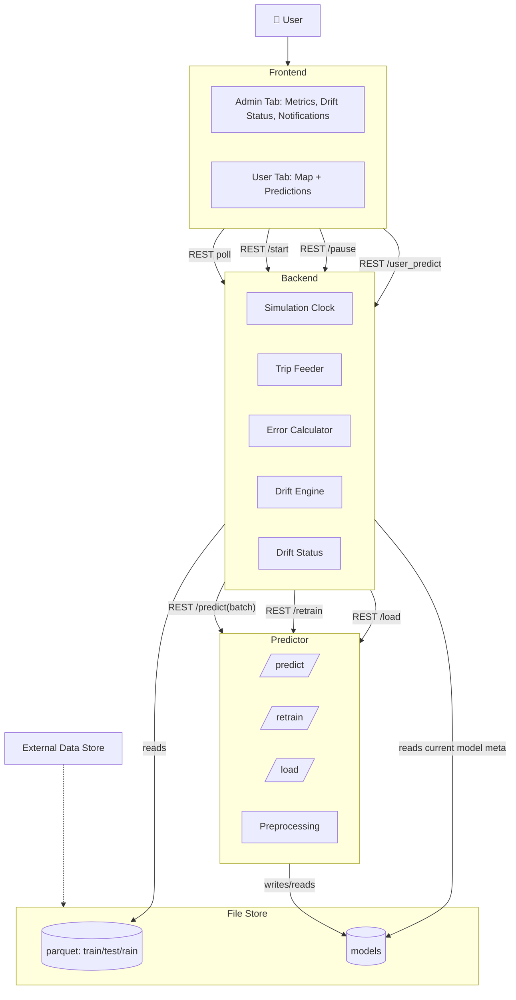
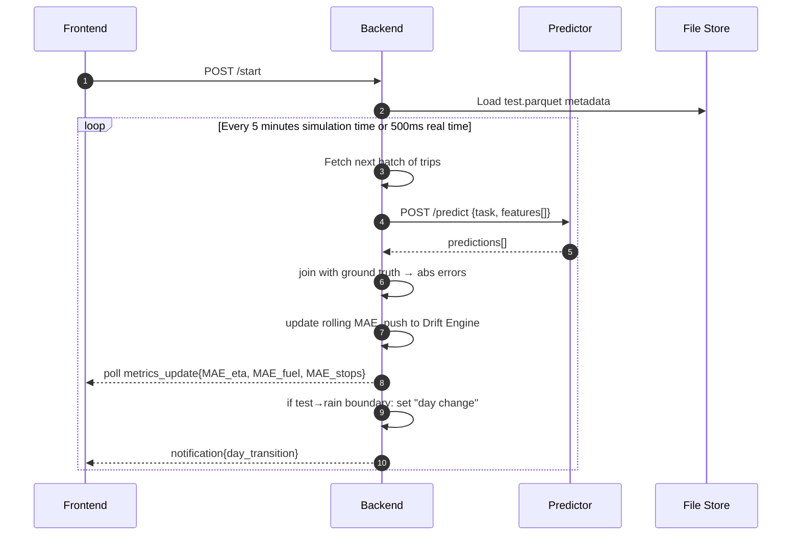
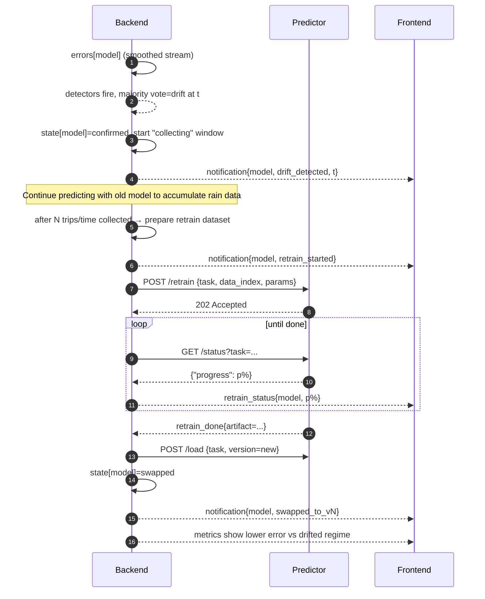
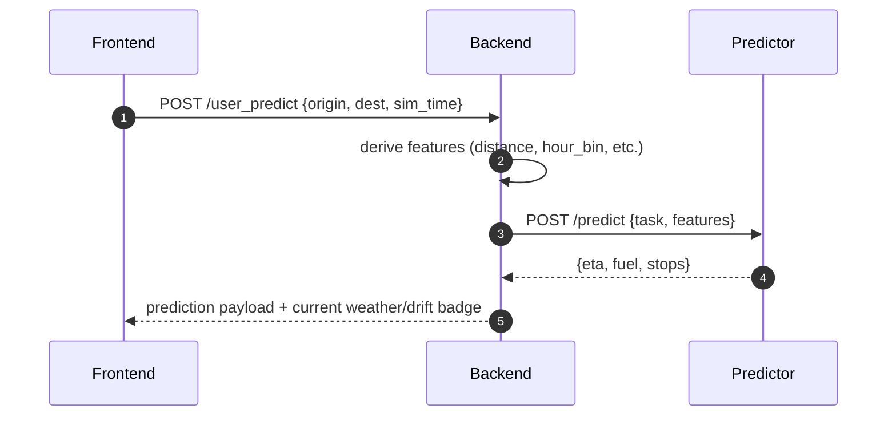

# Notes

## Platform

### Overview
We want to make a platform based around the concept of a drift detection and mitigation process.

We have 3 different machine learning models: estimated time of arrival prediction, fuel consumption prediction, number of stops prediction. All three of them will be XGBoost or LightGBM, but with different preprocessing steps, features and hyperparameters.

We have also generated some SUMO traffic data from Athens center map. One dataset is 10 hours of train data (which we used to train the models), one dataset is 10 hours of test data (which we will use on the platform to test the models), and one dataset is 10 hours of rain data (which is basically a concept drift scenario simulation, where the road friction is reduced from 1.0 to 0.4 to simulate rain, and will be used on the platform to test the models and detect drift).

The data is FCD with fuel and waiting time from emission output from SUMO in CSV format (all columns are merged in one file), for every timestep for every vehicle.

Following is a sample of the raw data.

  timestep_time;vehicle_fuel;vehicle_id;vehicle_lane;vehicle_odometer;vehicle_speed;vehicle_waiting;vehicle_x;vehicle_y
  0.00;493.10;0;224026852#1_0;0.00;0.00;0.00;2362.38;952.77
  1.00;1393.84;0;224026852#1_0;2.58;2.58;0.00;2364.55;954.18
  1.00;493.10;1;132654901#4_0;0.00;0.00;0.00;2357.43;259.58
  2.00;1186.29;0;224026852#1_0;6.74;4.16;0.00;2368.04;956.44
  2.00;1222.53;1;132654901#4_1;2.21;2.21;0.00;2351.48;261.56
  2.00;493.10;2;601294000_0;0.00;0.00;0.00;737.56;1402.36
  2.00;493.10;3;23182965#0_0;0.00;0.00;0.00;938.73;306.33
  3.00;1485.59;0;224026852#1_0;12.73;5.99;0.00;2373.06;959.70
  3.00;1578.11;1;132654901#4_1;6.79;4.58;0.00;2351.21;266.05

We do some preprocessing to get the data in a trip format, where we only keep the source and destination coordinates, the time the trip started, the distance traveled and some more features, different per model. There are around 55-60k trips in each dataset, and for example one of the models has 55 features. For each model, this preprocessing is different, and uses different features.

Following is a sample of the preprocessed data, for one of the models.

  source_x,source_y,destination_x,destination_y,time_start,distance,duration,hour_bin,is_morning,is_noon,is_afternoon,is_rush_hour,x_center,y_center,x_difference,y_difference,euclidean_distance,route_efficiency,detour_length,trip_bearing,trip_bearing_sin,trip_bearing_cos,is_short_distance,is_medium_distance,is_long_distance,source_distance_from_city_center,dest_distance_from_city_center,trip_centrality_change,trip_centrality,source_x_sin_0,source_x_cos_0,source_x_sin_1,source_x_cos_1,source_y_sin_0,source_y_cos_0,source_y_sin_1,source_y_cos_1,destination_x_sin_0,destination_x_cos_0,destination_x_sin_1,destination_x_cos_1,destination_y_sin_0,destination_y_cos_0,destination_y_sin_1,destination_y_cos_1,source_cell_x,source_cell_y,destination_cell_x,destination_cell_y,source_cluster,destination_cluster,source_pca_1,source_pca_2,dest_pca_1,dest_pca_2
  2362.38,952.77,2115.96,385.36,0,1047.29,109,0,1,0,0,1,2239.17,669.065,-246.42000000000007,-567.41,618.6088622869867,0.5906758035376893,428.6811377130133,-1.9805085752826213,-0.9172354852827272,-0.3983454085817481,1,0,0,1114.7338604771005,973.834832527481,-140.8990279496195,999.9118457364145,0.7027194660496225,-0.7114670421283992,-0.999923479912746,0.012370704069866805,0.8150236442607626,0.5794276998003339,0.9444945509537986,-0.3285270814081882,0.8550424281764858,-0.5185580449844155,-0.886778259867852,-0.4621951079638818,0.375892759839825,0.9266631713303382,0.6966519538265709,0.7174092661999992,23,9,21,3,6,9,1106.2509684750328,137.26024348743942,871.2860817997405,-434.98832709152407
  2357.43,259.58,1267.94,800.29,1,2255.85,234,0,1,0,0,1,1812.685,529.935,-1089.4899999999998,540.71,1216.2876979563673,0.5391704669886594,1039.5623020436326,2.680912285824505,0.44455764940195674,-0.895750242175913,0,0,1,1246.0991768035572,40.13556194048826,-1205.9636148630689,638.238254753968,0.7062326043519012,-0.7079798786338005,-0.9999969470325838,0.0024710171006620024,0.2566746454387672,0.9664978667275387,0.4961509945192318,0.8682362527777663,0.9544884908858594,0.2982477506477369,0.569348090851721,-0.8220965584671307,0.717558105677578,0.6964986467872036,0.9995564991912447,-0.029779270047188378,23,2,12,8,12,4,1115.2355589573838,-555.8892034097389,15.097039815058224,-37.18793784416289
  355.9,1247.28,1311.94,1248.67,6,1262.12,137,0,1,0,0,1,833.9200000000001,1247.975,956.0400000000001,1.3900000000001,956.0410104697393,0.757488202761813,306.0789895302606,0.0014539130377146518,0.0014539125254858472,0.9999989430686256,0,1,0,986.6858171344712,415.0179871794869,-571.6678299549843,586.8482020790519,0.34843410618770926,0.937333277786067,0.653197765690768,0.7571873472903443,0.9481234331057038,0.3179024309373145,0.6028214884258711,-0.797876088808292,0.9666833621957988,0.2559751496802495,0.49489383666295284,-0.8689534454923478,0.9485644014079175,0.31658423268008645,0.6006010663347422,-0.7995488472367218,3,12,13,12,0,8,-905.7434954295172,391.37912849491477,50.07540718444534,411.98590179498206
  1333.79,1266.76,1140.95,1165.16,51,454.02,47,0,1,0,0,1,1237.37,1215.96,-192.83999999999992,-101.59999999999991,217.96748748379872,0.4800834489313218,236.05251251620126,-2.6566873704988367,-0.4661245636808644,-0.8847191029549005,1,0,0,436.4178767977175,346.2228028848089,-90.19507391290858,378.5339348235776,0.9720452251719309,0.23479369714804976,0.4564601844264524,-0.8897438395590997,0.9541358941069565,0.29937383916554666,0.5712866514089021,-0.8207506088465628,0.909029800814137,0.4167311138273821,0.7576420027911172,-0.652670357536379,0.918851486410087,0.39460353004246396,0.7251640802443708,-0.6885761081560525,13,12,11,11,10,8,71.55737132886134,430.5114467666697,-119.20143836431339,325.0557588003817
  740.58,295.74,106.45,441.03,516,1174.97,136,0,1,0,0,1,423.51500000000004,368.385,-634.13,145.28999999999996,650.5613276240757,0.5536833515954243,524.4086723759243,2.916363008216771,0.22333021320313592,-0.9747428460217812,0,1,0,746.3133373063838,1213.813803823966,467.50046651758225,953.6017321961506,0.6747161099529707,0.7380773475523624,0.9959853535698734,0.08951634193986158,0.2914478040397731,0.9565867328791436,0.5575902053424149,0.8301163550407881,0.10624907236104512,0.9943395469468251,0.2112953089500041,0.9774222692448348,0.42687113317477243,0.9043124657230407,0.7720497739745339,0.6355620713241713,7,2,1,4,7,3,-502.01461474805217,-552.2362936468023,-1138.936923508409,-419.7220921309788

Following is the description of the dataset from the Zenodo release.

  This release provides 3 trace files containing Floating Car Data (FCD) from 10-hour microscopic traffic simulations of central Athens, generated with the SUMO (Simulation of Urban MObility) toolkit.

  Each simulation reflects distinct conditions and configurations.

  - train-fcd - Training simulation on the base network
  - test-fcd - Test simulation on the base network
  - rain-fcd - Simulation on the rain-modified network (with reduced friction on all lanes)

  These files are now available in both CSV and Parquet format. The output is organized by timestep and for each vehicle that is in the simulation at that timestep a row of its id, x, y, speed, lane, odometer, fuel, and waiting time is logged.

  Each simulation has a duration of 10 hours, spanning from morning to afternoon. There is a traffic pattern applied, with morning and afternoon peaks and lower mid-day activity. This traffic pattern is described by a list of per-hour traffic generation periods. On that list, some noise is added for each simulation, using a different random seed for each one. The same random seed is also used together with the traffic generation periods to generate the random trips used for each simulation. The goal was to introduce realistic variability, without going completely off a common traffic pattern.

  For the generation of this synthetic dataset, the following tools were used.

  - osmGet – Extract OpenStreetMap data from a bounding box over central Athens
  - osmBuild – Convert OSM data into a SUMO-compatible network
  - randomTrips – Generate random trips based on per-hour traffic generation periods
  - sumo – Run the microscopic simulation and export FCD data

We will use the test data and then the rain data, one after the other and have the models predict on those trips. This will be done in a sped up fashion, in something like a timelapse, for example the whole 20 hours of data will be compressed into 4 mins of timelapse. This is for demonstration purposes, to show the concept drift and the mitigation process in a reasonable time frame.

Other than that, we will have graphs to monitor the performance of the models, and if possible these can be dynamically filled in, as the timelapse progresses, every second or so when a value is calculated and added to the graphs. Since we have 3 different models/ML tasks, we can have a total of 3 graphs that show the MAE of each model.

This will be the admin tab of our frontend, and we will also have a user tab, where when clicked, the timelapse-simulation will pause. A map of central Athens will appear, where the user will be able to select a source and destination for a trip, and ask for predictions. The points on the map will be transformed to proper source and destination pairs, based on the bounding box of the map and the coordinates we use on our data. We will then predict on that state, based on the models we have loaded and for that specific time, based on the timelapse-simulation clock, and return the predictions, sort of like a Google Maps type of application. For this to happen, other than the source and destination pairs, we will need the start time for the trip, which the backend will have, and we will also need some more information like distance of the route (might be able to calculate it using sumolib or traci on the fly), or number of edges traversed (again might be able to calculate it using sumolib or traci on the fly) and many more, that are different per model, and will be calculated by their preprocessing and feature building steps.

At some point after the 10 hours of base test data ends, the day will change, and the rain scenario will begin. This should send a notification to the user, and if we then swap to the user tab, a rain effect can be added to it. Then, as the predictions continue with the base models on the drifted rain data, the graphs will show higher errors than before. Then, we will have a drift detection mechanism, that will be receiving the errors (or absolute errors) for each prediction of each model, similar to what will be depicted on the graphs as well, and will detect drift based on these errors, with a total of 4 voters (ADWIN, Page-Hinkley, KSWIN, and SPC), needing a majority vote of 3 to declare drift, over a rolling window. This will happen independently for each model, and for each drift detection, there should be a notification that drift has been detected for that model. Also there is a chance each concept drift predictor will need an initialization with some train data, so that it can be properly calibrated.

After the drift detection happens for a model, and the relevant notifications/visuals are shown (for example, background or some overlap with red for drift detected, yellow for collecting, blue for retraining and green for swapped), we will wait for some time so that the graphs have enough high errors calculated and shown, and in order to "collect" more drifted rain data, so that we can retrain the model with some old test data and the new "collected" rain data. This time might be a fixed amount of simulation seconds. However, bare in mind, as is the case with the whole pipeline and platform, we already have all the data we want, we just want to make this somewhat realistic, so in real life, we would have to wait to collect more data before retraining, and that is what we are doing here as well.

After enough data has been collected for a model to retrain, a notification should go out that the model is being retrained as part of the drift mitigation process. The errors, on the meantime should remain high, as we are still predicting with the base model. When retraining is done for a model and it is added to the model registry, it should be swapped in the system, a notification should go out that the retrained model is ready to be used, and it should then continue with the predictions with this new model. The errors should start to fall down a bit, not to the base level, but to a level that is better than the first drifted errors with the base model.

This is let's say the scenario for the platform, we can adjust it to fit our needs, based on its performance as well.

We want to keep this in general simple, and not too complex. We don't know if there is a better way to do this, or any other ideas to suggest for improvement or changes. We are mainly using Python, and we will probably use FastAPI for the Backend, Dash Plotly or any other capable framework for the Frontend that integrates well with Python (streamlit comes to mind), River library for the Drift Component and a FastAPI if needed for the communication. If a database is needed, we can use whatever integrates best with Python. Consider however that our models can be stored as simple files in the filesystem, and same for the data (test and rain), in parquet format. Maybe redis could be an option just to store anything that is needed for simulation state, errors, drift status, model versions, etc. We are open to ideas and to changes to make this more feasible and not extremely complex on an engineering aspect.

The Backend probably is the one responsible for driving the simulation clock of the timelapse, and all the communications. It will send requests for predictions to the predictors in simulation order, it will receive the predictions or the errors, match them to the ground truth and compute errors (or absolute errors), or just receive those from the predictors. These errors then should be plotted in the Frontend and ingested by the Drift Component, that is managing the drift state for the 3 models (stable > drift > collecting > retraining > swapped). Also some rest endpoints for run control should be provided (start, pause/resume, restart, etc.), as at least the pause/resume one is needed to go to the user tab. These are all ideas and thoughts and can be reduced, modified or removed if not necessary.

The models will be served on the Predictors running FastAPI and Uvicorn or any other capable framework, that will load the model weights from the filesystem and also run the code for the preprocessing steps, and serve some endpoints, like /predict and /retrain, and maybe /status for training progress, or /load to load model weights. The Backend will be orchestrating the whole process, and the Frontend will be a simple dashboard with the graphs and metrics, the notifications, and the user tab to request a prediction for a specific trip. The notifications can be timestamped and include a descriptive message.

Finally, the ground truth should be considered as available immediately, and not in the future, so we can use it instantly to calculate the errors, even though this is not realistic.

For a general orchestration, using Docker is a good idea, with various containers for all the components, and possibly a docker compose file to run the whole platform. But if there is another better or simper way to do this, let me know.

Give me a good plan for this, the architecture, the components, their roles, what communications will go on, how it will be orchestrated, what tools to actually use, since I'm open to suggestions, and if its feasible to do this with the tools suggested, other ideas for changes or improvements, etc. Get technical because I need it to make sure this is possible to do, and there are tools to do it, so be detailed, without becoming too complex or over engineering it.

Give me what I'm asking for, but keep in mind that the goal is to do something that is worth it, isn't extremely complex since we are undergraduate students doing this for a thesis, but keeps a level of realism with some room for future improvements.

Here's an overview of what I'm planning to build. Take the overall plan as a guide, and the more technical details can be adjusted to fit whatever we decide to work with, so it's not an exact spec, but rough guidelines. Can you help me start with this and provide an MVP of this architecture, so that I can work on it iteratively later and refine it to match the final wanted product? Also make sure to plan on the iterations, and how this can be built in steps, starting from a working core and having laid out a proper skeleton that will be easy to extend and modify later down the road.

I'd like to use docker and docker compose. I also use uv and a pyproject.toml to handle the envs, with Python 3.12.11. I already have one on my root for the env I was using on my experiments, and I also have the thesis/ folder which contains all my library code that I used on the experiments. This is installed editable on the environment so I can do global imports with safety. We can add folders for the backend, frontend, and whatever else is needed inside the thesis/ folder.

I'm not sure how we should handle the different environments for the different containers/components, but use uv and pyproject.toml if possible. If it makes sense for them to be separate, and different from the root environment, then do that. Also make the dockerfiles efficient, so that they don't have to be rebuilt every time, and only the changed files are rebuilt.

Also keep in mind, the drift service will be done by a colleague, keep it as a blackbox for now, but design around it and handle the communication with it, and my colleague can later reform his code to fit our needs. The frontend will also be designed by a colleague, so keep it simple and efficient, but being able to see the interactions and replies from the backend.

Keep it simple. I need you to plan this and explain everything in detail before proceeding with the implementation. Then we can start building on top of that.

I'm thinking for a first iteration, to have a backend, frontend, a predictor for my model (ETA) and have that run the predictions for the test dataset as a timelapse simulation, like we discussed. Then later on, we can add the rain dataset, and the drift component to work properly (it can even be added to the first iteration, by mocking it and making it detect drift at a certain point). Then we can add the user tab to the frontend, and then finally the rest of the models (Fuel and Stops).

As for how the predictions will be performaned, I leave it to you to decide. I was thinking that each real second (equal to 5 simulation minutes) I could be sending the indexes of start and end simulation time (for example 0 and 299) to the predictor, and it would then read the corresponding trips, run the predictions and return them, or the errors. I'm open to suggestions and changes to this.

Also, consider that I currently have only the fcd raw data as a parquet file, and I am building the trips and features on the fly. This could change, and I could have them precomputed and saved as a parquet file and then just read the trips we need each time.

Also, we would need a model versioning system or so, where each time there is a folder or a model called latest and when it changes the predictor should hot swap the model.

Also, for the frontend, it could be a dynamically changing chart, or it could be that it is reading a list of errors and each update (most likely each second) it is replotting the chart by calculating the MAE for each batch (5 minutes or something else if decided).

You need to plan accordingly for all these things, leaving space for where changes might be needed in the future, like adding more models, different preprocessing steps, different features, etc.

Finally, create some component diagrams, sequence diagrams and a state diagram for the backend. Also, add docs for the code and the architecture, and create a proper plan for the implementation, with the different iterations and the changes that will be needed.

### Components Diagram


### Sequence Diagrams

#### Timelapse Prediction Loop


#### Drift Detection → Data Collection → Retrain → Swap


#### User Query Map Origin/Destination at Current Sim Time


## Archive

### Environment Setup
To construct the environment with uv, the following commands were used.
```bash
uv init --bare --package --python ">=3.12.11,<3.13.0"
uv python pin 3.12.11
echo "" >> pyproject.toml
echo "[tool.uv.build-backend]" >> pyproject.toml
echo 'module-root = "."' >> pyproject.toml
echo 'module-name = "thesis"' >> pyproject.toml
```

### Closure Drift
When trying out the closure drift scenario, there were a few problems with the implementation and the quality of the data generated. Two options were tried, and both of them had their own problems, leading to the conclusion that it was not possible to create a realistic closure scenario that would be strong enough to be detected by the drift detector, while also not completely messing up with the traffic patterns.

Option one was to use a rerouter on some lanes that would make the act as closed. This was done by using the [closingLaneReroute](https://sumo.dlr.de/docs/Simulation/Rerouter.html#closing_a_lane) rerouter. This however meant that cars would be inserted on the network at the time they were supposed to leave based on the routes file, calculate a route and then while the car was following the route, if it had a closed lane on it, it would be blocked and not move. This could be observed on the gui, where cars would be first at green traffic lights and would not move, up until the point where 300 seconds would pass and the car would get teleported to the next lane. This was caused by the fact that cars didn't have a rerouter device on them, but adding one could possibly interfere with the whole simulation, as other cars would also change their, calculated at insertion time, routes and alter the network traffic behavior, when compared to the base scenario.

Option two was to generate a new network where the closed lanes or edges would be simply removed, and the junctions would be recalculated automatically, using the [netedit](https://sumo.dlr.de/docs/Netedit/index.html) tool. However, because this was changing the network capacity, the vehicles were getting inserted at different times than before, because of the reduced capacity and higher traffic generated by the missing lanes or edges. It was therefore hard to keep a similar traffic behavior, and when trying to tune the traffic to have a similarity to the base scenario, while also introducing a drift because of closed lanes or edges, it was hard to find a combination of lanes or edges to close. In some cases, closing whole roads, even main ones like Panepistimiou, would not lead to much change. In other cases, closing some smaller edges/lanes would completely bottleneck the network traffic flow. It was therefore hard to find a realistic scenario of closed edges that made sense, while also being strong enough to be detected by the drift detector, while not completely messing up with the traffic patterns. Betweeness centrality and other similar network metrics were utilized to give a better idea on what lanes or edges would be a good fit for closure, but it was again hard to find a realistic combination, like an event happening around an area, a whole edge/road closed for works or metro works around a block/square etc.

Finally, in almost every closure scenario that was simulated, the results from the models were not as expected, since frequently the drifted scenario would return better results than the scenario where we had retrained the models on the drift data. Therefore, it was decided not to include this drift scenario on this project.
