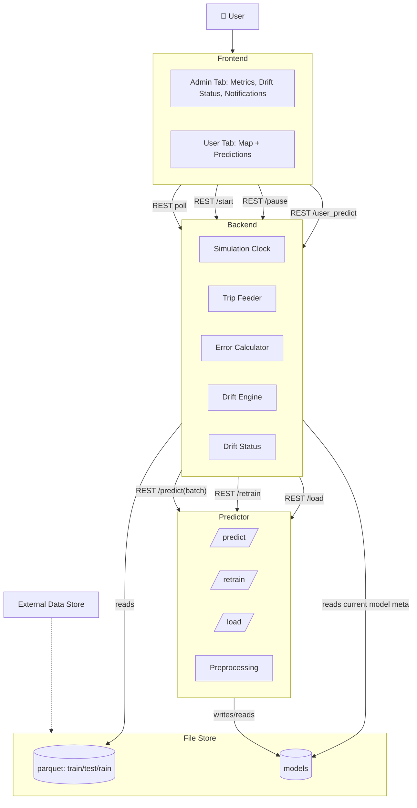
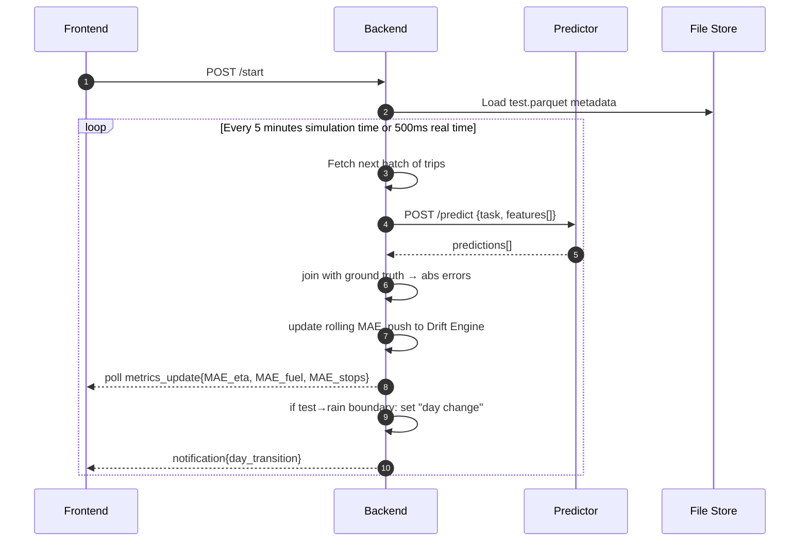
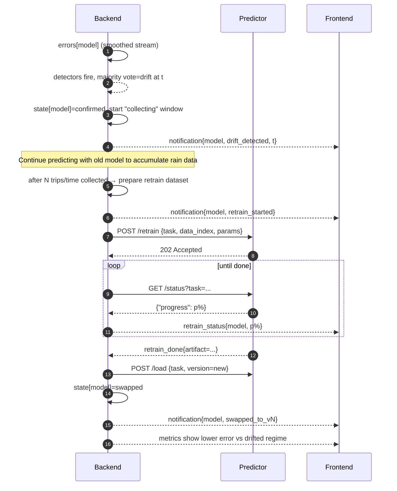
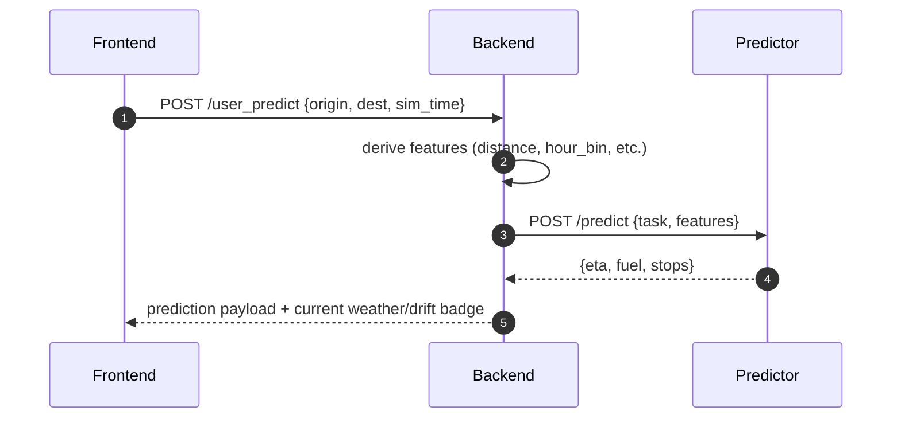

# Notes

## To Do

- Docstrings
- Type hints
- Config
- Logging

## Plan

**You are a senior ML systems architect and Python engineer.** Your task is to design an MVP platform for **drift detection and mitigation** across multiple tabular ML regressors, using synthetic traffic data generated with **SUMO** for central **Athens**. Provide a practical, implementation-ready plan that 1 person can build iteratively in around 1-2 weeks. Keep it as simple as possible but realistic, and leave clean seams for future growth.

### 1) Context & Goals

* We simulate a **20-hour timelapse demo** (10h base “test” + 10h “rain” drift) compressed to \~4 minutes.
* We have **3 regression models** (initially build ETA; add Fuel and Stops later). Models are **XGBoost or LightGBM** with **different preprocessing/feature sets** per task.
* **Drift** is induced in the “rain” set (lane friction 1.0→0.4). We want:
  * Live MAE plots per model.
  * A **drift detector** (treat as external black box for now) that votes using **ADWIN, Page-Hinkley, KSWIN, SPC** over a rolling window; **majority=3** triggers drift.
  * A simple **mitigation** loop: detect → collect N minutes of data (mostly rain but could be test data as well) → retrain → hot-swap model → errors improve (not necessarily back to baseline).
* **Ground truth is available immediately** (for demo), so errors can be computed right away.

### 2) Data

* Source: **SUMO FCD** (CSV/Parquet). Columns (semicolon or comma delimited), one row per (timestep, vehicle):
  `timestep_time, vehicle_fuel, vehicle_id, vehicle_lane, vehicle_odometer, vehicle_speed, vehicle_waiting, vehicle_x, vehicle_y`
* Three files (each **10 hours**): **train-fcd**, **test-fcd**, **rain-fcd**; \~**55–60k trips** per set after preprocessing.
* We **preprocess** into **trip-level** rows (src/dst coords, start time, distance, duration, engineered features). One model has \~**55 features**.
  We can either:
  1. **Build features on the fly** from FCD; or
  2. **Precompute trips/features** to Parquet and read slices per sim window.

  For the MVP, we will use the precomputed features. We can allow the option to switch to the on-the-fly features later.

### 3) Simulation & UX storyboard

* **Timelapse driver**: every **1 real second ≈ 5 simulation minutes**. For each tick:
  * Orchestrator requests predictions for trips with `timestep_time in [start,end]`.
  * Predictor returns errors (or predictions+errors, but predictions are not needed for this batch predict, only for a certain usecase we will discuss later).
  * Errors feed both the **live charts** and the **drift detector**.
* **Admin tab**: three live MAE charts (ETA/Fuel/Stops).
  Visual states: **stable (green) → drift (red) → collecting (yellow) → retraining (blue) → swapped (green)** with timestamped notifications.
* **User tab** (later iteration): after pausing the timelapse, the user can switch to the user tab, which opens a map of Athens to pick source/destination. Backend maps clicks inside the bounding box of Athens to our coordinate system, computes needed features (using the model feature building pipeline or including distance/edges via `sumolib`/`traci` if chosen), and returns predictions with the **current sim time** as context, for the current model version.

### 4) Architecture

* Keep components minimal and decoupled. Assume **Docker + docker-compose**. There is already the `thesis/` folder with the code for the experiments, dataset simulation, feature engineering, model training, evaluation, etc. It is installed editable on the root environment so we can do global imports with safety. There is a `pyproject.toml` file containing dependencies for the following possible containers: backend, frontend, predictor, drift. You can use this as a starting point, together with the `docker-compose.yml` file, to plan the architecture. There is also an `appdata` folder set up, including data, logs, and models folders, that we can use and volume mount to the containers.
* We will probably be based on **these containers**:
  1. **backend** (FastAPI + Uvicorn): simulation clock, orchestration, metrics updates, notifications, REST control (`/start`, `/pause`, `/resume`, `/restart`).
  2. **predictor-eta** (FastAPI + Uvicorn): model loading, data loading, data preprocessing for single predict, `/predict`, `/retrain`, `/status`, `/load`. Later: `predictor-fuel`, `predictor-stops`.
  3. **frontend** (Dash/Plotly + Gunicorn): admin dashboard with live charts & notifications; later: user map tab.
  4. **drift-service** (River + FastAPI + Uvicorn): consumes absolute errors per sample per model; returns state transitions/events when drift is detected.
  5. **redis**: optional, but probably helps with some state and storing metrics for the running simulation, as an easy to implement and efficient solution, without much overhead, and can be used for other things if you judge it necessary.
* **Storage**:
  * **Datasets** (Parquet) volume: `appdata/data/{test,rain}-trips.parquet`.
  * **Model registry** volume: `appdata/models/<task>/<version>/<model_name>.joblib` and `appdata/models/<task>/latest.txt → <version>` pointer.
  * **Logs** volume: `appdata/logs/<service_name>/`.

### 5) Interfaces & contracts

* **Backend ↔ Predictor** (JSON over HTTP):
  * `POST /predict`: `{start_ts, end_ts, return_type: "predictions"|"errors"|"both"}` → returns batched predictions, errors, or both.
  * `POST /retrain`: `{start_ts, end_ts}` → async job id; `GET /retrain/status/{job_id}` for progress.
  * `POST /load`: `{version | "latest"}` → 200 on success; model hot-swapped.
* **Backend ↔ Drift-service** (black box; define this now so we can mock it):
  * `POST /errors`: `{task, errors: [..]}`;
  * `GET /state?task=ETA`: `{state, start_ts}`;
  * **Events**: `drift_detected`, `collecting_started`, `retraining_started`, `swapped`.
* **Backend ↔ Frontend**:
  * Consider what is the best, but possible REST for receiving the errors and then some calculations to get whatever MAE we need to show in the frontend. Maybe we can use SSE/WebSocket for **live updates**: `{ts, task, mae, state, notification?}`, but only if it's not too much overhead.
  * REST for controls: `/start`, `/pause`, `/resume`, `/restart`.
  * Later: `/predict_single` for single user map queries.

The above are given to get an idea, you don't have to follow them exactly, feel free to change them to fit our needs, based on what you think is best, as an expert.

### 6) Drift lifecycle

* Per model: **stable → drift → collecting → retraining → swapped**.
  * Trigger: majority vote (ADWIN, Page-Hinkley, KSWIN, SPC) over sliding window; configurable thresholds.
  * Collect for **K sim minutes** after drift before retraining.
  * Retrain on collected data with simple strategy (partial fit based on stable).
  * On success, **update model registry** and instruct predictor to `/load latest`.

### 7) Model versioning & hot swap

* Filesystem registry with `latest.txt` pointer per task.
* Predictor watches for changes (or backend specifically calls `/load`, when retraining is done).
* Document expected **model metadata** (task, version, created_at, model, start_ts, end_ts).

### 8) Tooling & stack constraints

* **Python 3.12.11**, **uv** for envs, **pyproject.toml** everywhere.
* Use **FastAPI + Uvicorn**, **pandas/pyarrow**, **xgboost/lightgbm**, and (optionally) **river** for drift if helpful in mocks.
* Containers: **python:3.12.11-slim**, maximize layer cache, check provided Dockerfiles and improve if possible.
* Keep services **independently buildable**.

### 9) Deliverables

1. **High-level architecture**: one paragraph + a **Mermaid component diagram** showing containers, volumes, and dataflow.
2. **Backend state diagram** (Mermaid) for the drift lifecycle.
3. **Two sequence diagrams** (Mermaid):
   * a) Timelapse tick (predict → error → drift update → UI).
   * b) Drift detection → collect → retrain → hot-swap.
4. **docker-compose.yml** (minimal) plus **Dockerfiles** for backend, predictor, drift and frontend with caching best practices, based on the provided ones.
5. **Repo layout** (monorepo) with folders under `thesis/` (`backend/`, `predictor/`, `frontend/`, `drift/`, `common/`), and a root `pyproject.toml` using **uv**, based on the provided one.
6. **Implementation plan** with **iterations/milestones**:
   * **Iteration 1 (MVP)**: backend + predictor-eta + frontend admin charts; run only **test** dataset; mock drift service; no retrain.
   * **Iteration 2**: add **rain** dataset and real drift lifecycle; notification system.
   * **Iteration 3**: user map tab and one-off prediction.
   * **Iteration 4**: add Fuel & Stops predictors; basic model registry + hot-swap.
     For each iteration: exact goals, acceptance criteria, and definition of done.
7. **Risks & simplifications**: call out at most 8 risks (I/O, feature latency, UI flicker, drift thresholds, etc.) with a one-line mitigation each.

### 10) Assumptions you can make

* Datasets are present under `./appdata/data/*.parquet`, or under `/app/data/*.parquet` for containers.
* Model artifacts use joblib; predictors don't handle their own preprocessing, but it can be done through the relevant code under `common/` or `eta/` folders, as seen in the experiments.
* For the map tab, a simple bounding box conversion is OK (no full routing).
* Ground truth is instantly available for each batch.

### 11) Additional notes

* The test and rain datasets could be merged, by adding 36000 seconds to the timestamps of the rain dataset. This would be a good idea, since it would eliminate any need for specifying dataset name, and we would only be using the timestamps to split the data into batches.
* The errors returned by the predictor could also have timestamps included, so we can use them to plot the errors over time and also digest the errors in correct order in the drift service.
* I haven't talked a lot about notifications, but on later iterations (2 or later) we would like to have notifications for the drift events on the frontend.

### 12) Style & constraints for your response

* Be **concise and prescriptive**; prefer **working defaults** over options.
* No over-engineering; avoid heavy infra.
* Include **code blocks with filenames** and keep each file short but runnable/stubbed.
* Use **Mermaid** for all diagrams.
* If any detail is ambiguous, **state a sensible default** and proceed—don’t ask me questions.

## Archive

### Environment Setup

To construct the environment with uv, the following commands were used.
```bash
uv init --bare --package --python ">=3.12.11,<3.13.0"
uv python pin 3.12.11
echo "" >> pyproject.toml
echo "[tool.uv.build-backend]" >> pyproject.toml
echo 'module-root = "."' >> pyproject.toml
echo 'module-name = "thesis"' >> pyproject.toml
```

### Closure Drift

When trying out the closure drift scenario, there were a few problems with the implementation and the quality of the data generated. Two options were tried, and both of them had their own problems, leading to the conclusion that it was not possible to create a realistic closure scenario that would be strong enough to be detected by the drift detector, while also not completely messing up with the traffic patterns.

Option one was to use a rerouter on some lanes that would make the act as closed. This was done by using the [closingLaneReroute](https://sumo.dlr.de/docs/Simulation/Rerouter.html#closing_a_lane) rerouter. This however meant that cars would be inserted on the network at the time they were supposed to leave based on the routes file, calculate a route and then while the car was following the route, if it had a closed lane on it, it would be blocked and not move. This could be observed on the gui, where cars would be first at green traffic lights and would not move, up until the point where 300 seconds would pass and the car would get teleported to the next lane. This was caused by the fact that cars didn't have a rerouter device on them, but adding one could possibly interfere with the whole simulation, as other cars would also change their, calculated at insertion time, routes and alter the network traffic behavior, when compared to the base scenario.

Option two was to generate a new network where the closed lanes or edges would be simply removed, and the junctions would be recalculated automatically, using the [netedit](https://sumo.dlr.de/docs/Netedit/index.html) tool. However, because this was changing the network capacity, the vehicles were getting inserted at different times than before, because of the reduced capacity and higher traffic generated by the missing lanes or edges. It was therefore hard to keep a similar traffic behavior, and when trying to tune the traffic to have a similarity to the base scenario, while also introducing a drift because of closed lanes or edges, it was hard to find a combination of lanes or edges to close. In some cases, closing whole roads, even main ones like Panepistimiou, would not lead to much change. In other cases, closing some smaller edges/lanes would completely bottleneck the network traffic flow. It was therefore hard to find a realistic scenario of closed edges that made sense, while also being strong enough to be detected by the drift detector, while not completely messing up with the traffic patterns. Betweeness centrality and other similar network metrics were utilized to give a better idea on what lanes or edges would be a good fit for closure, but it was again hard to find a realistic combination, like an event happening around an area, a whole edge/road closed for works or metro works around a block/square etc.

Finally, in almost every closure scenario that was simulated, the results from the models were not as expected, since frequently the drifted scenario would return better results than the scenario where we had retrained the models on the drift data. Therefore, it was decided not to include this drift scenario on this project.

### Components Diagram



### Sequence Diagrams

#### Timelapse Prediction Loop



#### Drift Detection → Data Collection → Retrain → Swap



#### User Query Map Origin/Destination at Current Sim Time


