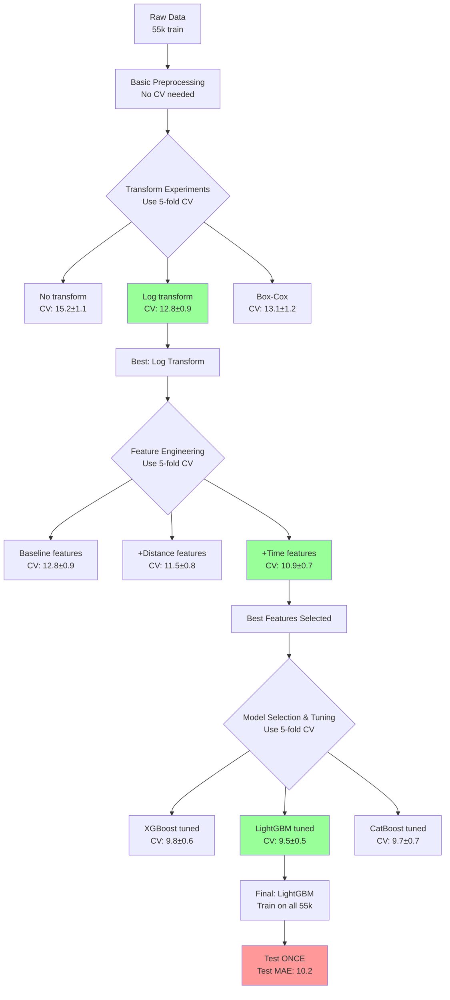

# Notes

## To Do
- New dataset with rain only 1 dataset and same seed same periods with base test
- Run new dataset pipeline with train, test, and rain scenarios and evaluate models
- Drop the config logic into utils and leave only statics
- Migrate to using yaml config files
- Create base save model and save results functions and wrap them with the scenario ones
- Dataclass for output metrics
- Use classmethod for creating the dataclass
- Refactor ScenarioSpec and DatasetSpec to Scenario and Dataset and first property is the name

- Sklearn pipeline for preprocessing and training
- Scaling of new features
- Log/Quantile/Box-Cox transformations of new features
- Training with various sub-trip augmentation rates

- One hot encode the hour bin
- Feature engineering
- Feature selection and feature importance
- SHAP values
- Extra distances (euclidean, manhattan, heaversine)
- Center and diff of lat and long coordinates
- Clustering features like MiniKBatchMeans for start and end coordinates, PCA for all coordinates

- Hyperparameter tuning with optuna
- Final model
- Model retraining pipeline

## Environment Setup
To construct the environment with uv, the following commands were used.

```bash
uv init --bare --package --python 3.12.9
uv python pin 3.12.9
echo "" >> pyproject.toml
echo "[tool.hatch.build.targets.wheel]" >> pyproject.toml
echo 'packages = ["thesis"]' >> pyproject.toml
uv add catboost==1.2.8 eclipse-sumo==1.21.0 ipykernel==6.29.5 lightgbm==4.6.0 matplotlib==3.10.1 numpy==2.2.3 optuna==4.4.0 pandas==2.2.3 requests==2.32.4 scikit-learn==1.6.1 scipy==1.15.2 seaborn==0.13.2 xgboost==2.1.4
```

## Closure Drift
When trying out the closure drift scenario, there were a few problems with the implementation and the quality of the data generated. Two options were tried, and both of them had their own problems, leading to the conclusion that it was not possible to create a realistic closure scenario that would be strong enough to be detected by the drift detector, while also not completely messing up with the traffic patterns.

Option one was to use a rerouter on some lanes that would make the act as closed. This was done by using the [closingLaneReroute](https://sumo.dlr.de/docs/Simulation/Rerouter.html#closing_a_lane) rerouter. This however meant that cars would be inserted on the network at the time they were supposed to leave based on the routes file, calculate a route and then while the car was following the route, if it had a closed lane on it, it would be blocked and not move. This could be observed on the gui, where cars would be first at green traffic lights and would not move, up until the point where 300 seconds would pass and the car would get teleported to the next lane. This was caused by the fact that cars didn't have a rerouter device on them, but adding one could possibly interfere with the whole simulation, as other cars would also change their, calculated at insertion time, routes and alter the network traffic behavior, when compared to the base scenario.

Option two was to generate a new network where the closed lanes or edges would be simply removed, and the junctions would be recalculated automatically, using the [netedit](https://sumo.dlr.de/docs/Netedit/index.html) tool. However, because this was changing the network capacity, the vehicles were getting inserted at different times than before, because of the reduced capacity and higher traffic generated by the missing lanes or edges. It was therefore hard to keep a similar traffic behavior, and when trying to tune the traffic to have a similarity to the base scenario, while also introducing a drift because of closed lanes or edges, it was hard to find a combination of lanes or edges to close. In some cases, closing whole roads, even main ones like Panepistimiou, would not lead to much change. In other cases, closing some smaller edges/lanes would completely bottleneck the network traffic flow. It was therefore hard to find a realistic scenario of closed edges that made sense, while also being strong enough to be detected by the drift detector, while not completely messing up with the traffic patterns. Betweeness centrality and other similar network metrics were utilized to give a better idea on what lanes or edges would be a good fit for closure, but it was again hard to find a realistic combination, like an event happening around an area, a whole edge/road closed for works or metro works around a block/square etc.

Finally, in almost every closure scenario that was simulated, the results from the models were not as expected, since frequently the drifted scenario would return better results than the scenario where we had retrained the models on the drift data. Therefore, it was decided not to include this drift scenario on this project.

## Coordinates Pairs Uniqueness
When studying the dataset and the coordinates pairs, it was noticed that the source X and Y coordinates only had around 1k unique values, which is close the around 1.1k edges on the network. However, the destination X and Y coordinates had around 45k unique values.

This can be explained by the following facts. First of all, the way the source and destination points are selected is through the [randomTrips](https://sumo.dlr.de/docs/Tools/Trip.html) tool, which actually selects from the list of edges in the network. After selecting a source and destination edge, the simulation will convert these to coordinates (X, Y) and that's also what is written in the FCD output. Therefore, the source and destination edges that are selected from the around 1.1k edges on the network can only have a limited number of unique coordinates (X, Y).

For the source coordinates, this is the case indeed, as can be seen in the dataset. For the destination coordinates, however, we see far more unique values. This is due to the nature of how we log stuff and write the outputs. Essentially, logging takes place every second, and each car is inserted into the network at a fixed time that is a multiple of 1 second. Therefore, when entering the simulation, its position is equal to the source coordinates, that are part of the around 1k unique values, based on the around 1.1k edges of the network. On the other hand, when the car exits the simulation, the time might not be a multiple of 1 second, and therefore the destination coordinates that are logged at the previous whole second, are not the actual destination coordinates, since there is a small delta between the time of exit and the last time of logging. This is why we see far more unique destination coordinates than source coordinates.

The effect of this on the ability of the models to generalize is not clear, but it is something to keep in mind. Also, the test dataset will have a similar problem, or at least pattern, since it might not be exactly problematic. This might mean that this doesn't require any handling at all and the model will take care of it by learning about the various unique edges (tied to unique source coordinates) and will learn about the destination coordinates since they will be all be pretty close to some specific points/areas that are the translation of network edges in X,Y coordinates.

Some solutions or ideas to check would be trip augmentation with sub-trips from the full trips, adding noise to the source coordinates, using clustering features for the source and destination coordinates, or clustering the destination coordinates into 1k clusters or so, to essentially map them to the unique X,Y coordinates of the edges in the network.

```python
# Spatial Binning/Grid Encoding
def add_grid_features(df, grid_size=100):
    """Divide space into grid cells"""
    df['source_grid_x'] = (df['source_x'] // grid_size).astype(int)
    df['source_grid_y'] = (df['source_y'] // grid_size).astype(int)
    df['dest_grid_x'] = (df['destination_x'] // grid_size).astype(int)
    df['dest_grid_y'] = (df['destination_y'] // grid_size).astype(int)
    
    # One-hot encode grid cells or use as categorical
    return df

# mRelative Positioning
def add_relative_features(df):
    """Use relative positions instead of absolute"""
    df['delta_x'] = df['destination_x'] - df['source_x']
    df['delta_y'] = df['destination_y'] - df['source_y']
    df['angle'] = np.arctan2(df['delta_y'], df['delta_x'])
    df['euclidean_distance'] = np.sqrt(df['delta_x']**2 + df['delta_y']**2)
    return df

# Coordinate Normalization
def normalize_coordinates(df):
    """Normalize to [0,1] range or z-score"""
    scaler = StandardScaler()
    df[['source_x_norm', 'source_y_norm']] = scaler.fit_transform(
        df[['source_x', 'source_y']]
    )
    return df

from sklearn.cluster import KMeans

# Clustering-Based Encoding
def cluster_encode_locations(df, n_clusters=50):
    """Group similar starting points"""
    kmeans = KMeans(n_clusters=n_clusters)
    df['source_cluster'] = kmeans.fit_predict(df[['source_x', 'source_y']])
    # Use cluster centers as features
    return df

# Add Random Spawn Offsets
def add_spawn_noise(df, noise_std=50):
    """Add Gaussian noise to spawn coordinates"""
    df['source_x_noisy'] = df['source_x'] + np.random.normal(0, noise_std, len(df))
    df['source_y_noisy'] = df['source_y'] + np.random.normal(0, noise_std, len(df))
    return df

# Recommended Combination Approach
import numpy as np
import pandas as pd
from sklearn.preprocessing import StandardScaler
from sklearn.cluster import KMeans


def enhance_trip_features(df_trips, n_clusters=50, grid_size=100):
    """
    Comprehensive feature engineering to handle limited source coordinate diversity.
    
    Args:
        df_trips: DataFrame with source_x, source_y, destination_x, destination_y
        n_clusters: Number of clusters for location encoding
        grid_size: Size of grid cells in meters
    
    Returns:
        DataFrame with enhanced features
    """
    df = df_trips.copy()
    
    # 1. Relative positioning features (most important!)
    df['delta_x'] = df['destination_x'] - df['source_x']
    df['delta_y'] = df['destination_y'] - df['source_y']
    df['euclidean_distance'] = np.sqrt(df['delta_x']**2 + df['delta_y']**2)
    df['manhattan_distance'] = np.abs(df['delta_x']) + np.abs(df['delta_y'])
    df['direction_angle'] = np.arctan2(df['delta_y'], df['delta_x'])
    
    # 2. Grid-based encoding
    df['source_grid_x'] = (df['source_x'] // grid_size).astype(int)
    df['source_grid_y'] = (df['source_y'] // grid_size).astype(int)
    df['dest_grid_x'] = (df['destination_x'] // grid_size).astype(int)
    df['dest_grid_y'] = (df['destination_y'] // grid_size).astype(int)
    
    # Grid distance features
    df['grid_delta_x'] = df['dest_grid_x'] - df['source_grid_x']
    df['grid_delta_y'] = df['dest_grid_y'] - df['source_grid_y']
    df['grid_distance'] = np.sqrt(df['grid_delta_x']**2 + df['grid_delta_y']**2)
    
    # 3. Cluster-based encoding for common start locations
    kmeans = KMeans(n_clusters=n_clusters, random_state=42)
    source_coords = df[['source_x', 'source_y']].values
    df['source_cluster'] = kmeans.fit_predict(source_coords)
    
    # Distance to cluster center
    cluster_centers = kmeans.cluster_centers_
    source_clusters = df['source_cluster'].values
    df['dist_to_source_cluster_center'] = np.array([
        np.linalg.norm(source_coords[i] - cluster_centers[source_clusters[i]])
        for i in range(len(df))
    ])
    
    # 4. Normalized coordinates (helps with generalization)
    scaler = StandardScaler()
    df[['source_x_norm', 'source_y_norm']] = scaler.fit_transform(df[['source_x', 'source_y']])
    df[['dest_x_norm', 'dest_y_norm']] = scaler.fit_transform(df[['destination_x', 'destination_y']])
    
    # 5. Quadrant-based features
    df['source_quadrant'] = (
        (df['source_x'] > df['source_x'].median()).astype(int) * 2 +
        (df['source_y'] > df['source_y'].median()).astype(int)
    )
    df['dest_quadrant'] = (
        (df['destination_x'] > df['destination_x'].median()).astype(int) * 2 +
        (df['destination_y'] > df['destination_y'].median()).astype(int)
    )
    df['same_quadrant'] = (df['source_quadrant'] == df['dest_quadrant']).astype(int)
    
    # 6. Add noise to source coordinates for training (regularization)
    if 'is_training' in df.columns and df['is_training'].any():
        noise_std = 30  # meters
        df.loc[df['is_training'], 'source_x_noisy'] = (
            df.loc[df['is_training'], 'source_x'] + 
            np.random.normal(0, noise_std, df['is_training'].sum())
        )
        df.loc[df['is_training'], 'source_y_noisy'] = (
            df.loc[df['is_training'], 'source_y'] + 
            np.random.normal(0, noise_std, df['is_training'].sum())
        )
    
    # 7. Ratio features
    df['x_ratio'] = df['delta_x'] / (df['euclidean_distance'] + 1e-6)
    df['y_ratio'] = df['delta_y'] / (df['euclidean_distance'] + 1e-6)
    
    return df


def select_robust_features(df, use_raw_coords=False):
    """
    Select features that are robust to limited source diversity.
    
    Args:
        df: DataFrame with enhanced features
        use_raw_coords: Whether to include raw coordinates (not recommended)
    
    Returns:
        List of feature column names
    """
    # Features that don't depend heavily on exact source location
    robust_features = [
        # Relative features (most important)
        'delta_x', 'delta_y', 'euclidean_distance', 'manhattan_distance',
        'direction_angle', 'x_ratio', 'y_ratio',
        
        # Grid-based features
        'grid_delta_x', 'grid_delta_y', 'grid_distance',
        
        # Cluster and quadrant features
        'source_cluster', 'dist_to_source_cluster_center',
        'source_quadrant', 'dest_quadrant', 'same_quadrant',
        
        # Time features (if available)
        'hour_bin',
        
        # Trip characteristics
        'distance', 'duration'
    ]
    
    if use_raw_coords:
        # Not recommended due to overfitting risk
        robust_features.extend(['source_x_norm', 'source_y_norm', 
                               'dest_x_norm', 'dest_y_norm'])
    
    # Only return features that exist in the dataframe
    return [f for f in robust_features if f in df.columns]


# Example usage
if __name__ == "__main__":
    # Simulated trip data
    trips = pd.DataFrame({
        'source_x': np.random.choice([1000, 2000, 3000], 1000),  # Limited diversity
        'source_y': np.random.choice([500, 1500, 2500], 1000),   # Limited diversity
        'destination_x': np.random.uniform(0, 5000, 1000),       # High diversity
        'destination_y': np.random.uniform(0, 5000, 1000),       # High diversity
        'hour_bin': np.random.randint(0, 24, 1000),
        'distance': np.random.uniform(500, 10000, 1000),
        'duration': np.random.uniform(60, 3600, 1000),
        'is_training': True
    })
    
    # Enhance features
    trips_enhanced = enhance_trip_features(trips)
    
    # Select robust features
    feature_cols = select_robust_features(trips_enhanced)
    print(f"Selected {len(feature_cols)} robust features")
    print(f"Features: {feature_cols}")
```

## Cross Validation


- Performance Metrics
  - MAE mean +- std (primary detection)
  - MAPE mean +- std (relative error)
  - RMSE mean +- std (outlier detection)
  - R^2 mean +- std (variance explained)
- Stability Metrics
  - CV std dev (model stability)
  - Fold-wise range (worst vs best fold)
  - Per-fold breakdown (identify problem folds)
- Efficiency Metrics
  - Training time (computational cost)
  - Prediction time (production latency)

- Primary Decision Metrics
  - MAE (mean ± std) - Your north star metric
    - Good: < 20 seconds
    - Acceptable: 20-30 seconds
    - Poor: > 30 seconds
  - MAPE (mean ± std) - For relative performance
    - Good: < 15%
    - Acceptable: 15-25%
    - Poor: > 25%
- Stability Metrics (Often Overlooked!)
  - Coefficient of Variation (CV%) = std/mean
    - Good: < 10% (very stable)
    - Acceptable: 10-15%
    - Poor: > 15% (unstable)
  - Fold Range = max_fold_mae - min_fold_mae
    - Identifies if one fold is problematic

## Model Retraining Pipeline

1. Incremental Learning (Most Common)
Train on combined historical + new data:
```python
# Instead of rain/rain, use base+rain/rain
trips_combined = pd.concat([trips_base_train, trips_rain_train])
X_combined, y_combined = split_features_and_target(trips_combined)
# Train on combined data, test on rain
```

2. Sliding Window Approach
Use recent historical data + new drift data:
```python
# Use last 20-30% of base + first 70-80% of rain for training
base_recent = trips_base_train.iloc[-int(0.3 * len(trips_base_train)):]
rain_initial = trips_rain_train.iloc[:int(0.7 * len(trips_rain_train)):]
trips_window = pd.concat([base_recent, rain_initial])
```

3. Sample Weighting
Give more importance to recent/drifted data:
```python
# Create sample weights that decay with age
base_weights = np.linspace(0.3, 0.6, len(trips_base_train))
rain_weights = np.linspace(0.8, 1.0, len(trips_rain_train))
sample_weights = np.concatenate([base_weights, rain_weights])

# For XGBoost/LightGBM/CatBoost
model.fit(X_combined, y_combined, sample_weight=sample_weights)
```

4. Ensemble Approach
Combine base model with drift-adapted model:
```python
# Keep base model, train a new model on rain data
# Ensemble predictions with weights
predictions = 0.3 * base_model.predict(X_test) + 0.7 * rain_model.predict(X_test)
```
