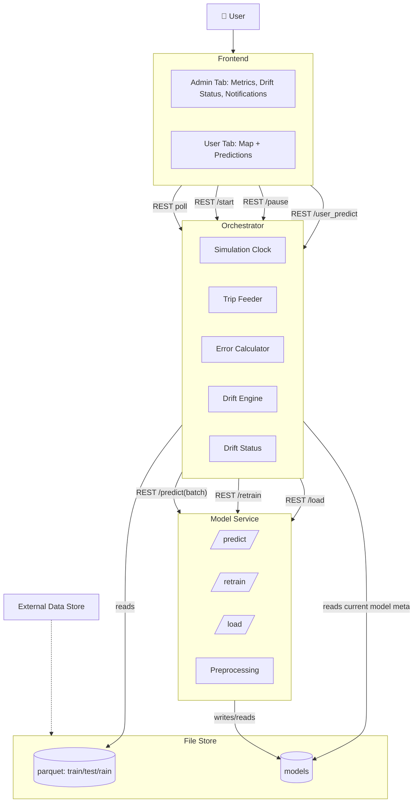
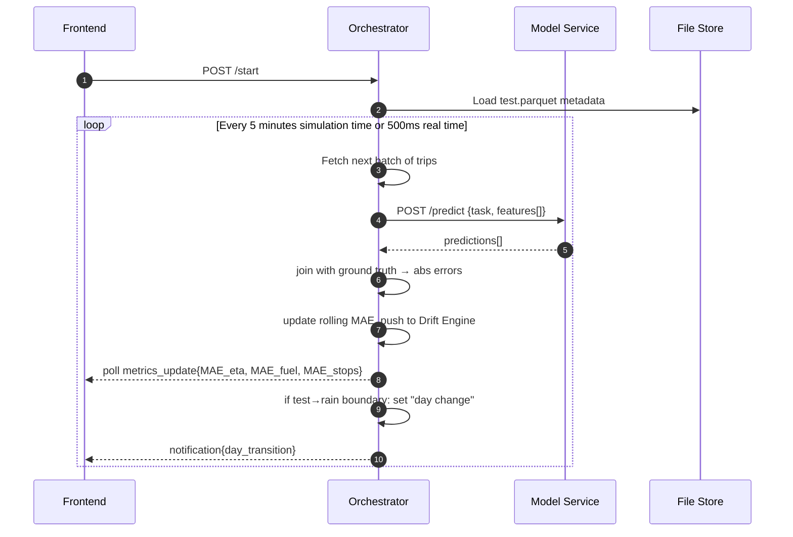
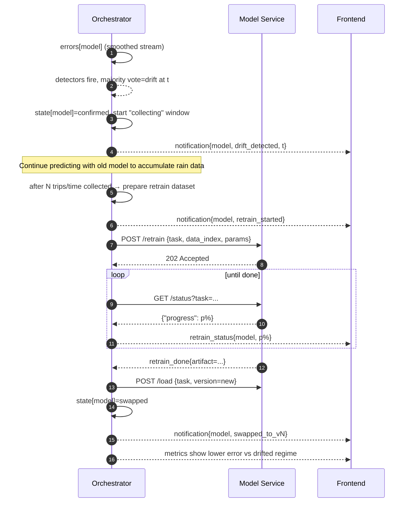
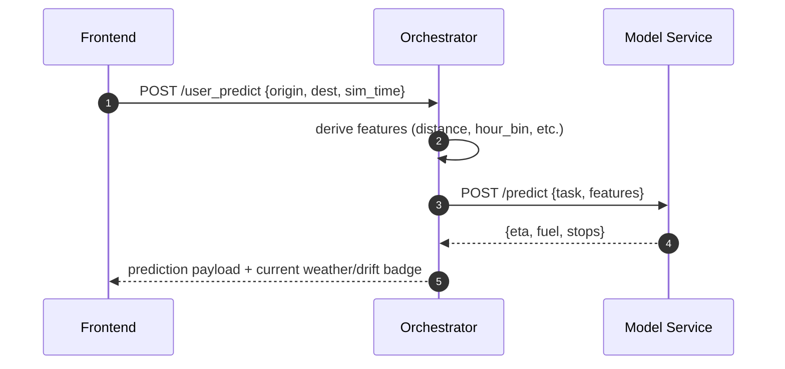

# Platform

## Prompt
We want to make a platform based around the concept of a drift detection and mitigation process.

We have 3 different machine learning models: estimated time of arrival prediction, fuel consumption prediction, number of stops prediction. All three of them will be  XGBoost or LightGBM, but with different preprocessing steps, features and hyperparameters.

We have also generated some SUMO traffic data from Athens center map. One dataset is 10 hours of train data (which we used to train the models), one dataset is 10 hours of test data (which we will use on the platform to test the models), and one dataset is 10 hours of rain data (which is basically a concept drift scenario simulation, where the road friction is reduced from 1.0 to 0.4 to simulate rain, and will be used on the platform to test the models and detect drift).

The data is FCD with fuel and waiting time from emission output from SUMO in CSV format (all columns are merged in one file), for every timestep for every vehicle. We do some preprocessing to get the data in a trip format, where we only keep the source and destination coordinates, the time the trip started, the distance traveled and some more features, different per model. There are around 55-60k trips in each dataset, and for example one of the models has 55 features.

Following is the description of the dataset from the Zenodo release.

  This release provides 3 trace files containing Floating Car Data (FCD) from 10-hour microscopic traffic simulations of central Athens, generated with the SUMO (Simulation of Urban MObility) toolkit.

  Each simulation reflects distinct conditions and configurations.

  - train-fcd - Training simulation on the base network
  - test-fcd - Test simulation on the base network
  - rain-fcd - Simulation on the rain-modified network (with reduced friction on all lanes)

  These files are now available in both CSV and Parquet format. The output is organized by timestep and for each vehicle that is in the simulation at that timestep a row of its id, x, y, speed, lane, odometer, fuel, and waiting time is logged.

  Each simulation has a duration of 10 hours, spanning from morning to afternoon. There is a traffic pattern applied, with morning and afternoon peaks and lower mid-day activity. This traffic pattern is described by a list of per-hour traffic generation periods. On that list, some noise is added for each simulation, using a different random seed for each one. The same random seed is also used together with the traffic generation periods to generate the random trips used for each simulation. The goal was to introduce realistic variability, without going completely off a common traffic pattern.

  For the generation of this synthetic dataset, the following tools were used.

  - osmGet – Extract OpenStreetMap data from a bounding box over central Athens
  - osmBuild – Convert OSM data into a SUMO-compatible network
  - randomTrips – Generate random trips based on per-hour traffic generation periods
  - sumo – Run the microscopic simulation and export FCD data

We will use the test data and then the rain data, one after the other and have the models predict on those trips. This will be done in a sped up fashion, in something like a timelapse, for example the whole 20 hours of data will be compressed into 2-3 mins of timelapse. This is for demonstration purposes, to show the concept drift and the mitigation process in a reasonable time frame.

Other than that, we will have graphs to monitor the performance of the models, and if possible these can be dynamically filled in, as the timelapse progresses, every second or so, and accompanied by labels with the latest metrics written out, everytime a value is calculated and added to the graphs. For example, since we have 3 different models/ML tasks, we can have a total of 3 graphs that show the MAE of each model, plus the latest calculated metrics labels.

This will be the admin tab of our frontend, and we will also have a user tab, where when clicked, the timelapse and simulation will pause. A map of central Athens will appear, where the user will be able to select a source and destination for a trip, and ask for predictions. We will then predict on that state, based on the models we have loaded and for that specific time, and return the predictions, sort of like a Google Maps type of application. For this to happen, other than the source and destination pairs, we will need the start time for the trip, which the backend will have, and we will also need some more information like distance of the route (might be able to calculate it using sumolib or traci on the fly, otherwise we will fix a list of 10 common routes with distances precalculated), or number of edges traversed (again might be able to calculate it using sumolib or traci on the fly).

At some point after the 10 hours of base test data ends, the day will change, and the rain scenario will begin. This should send a notification to the user, and if we then swap to the user tab, a rain effect can be added to it. Then, as the predictions continue with the base models on the drifted rain data, the graphs will show higher errors than before. Then, we will have a drift detection mechanism, that will be receiving the errors for each model as they are being sent to the graphs as well from the backend, and will detect drift based on the errors. This will happen independently for each model, and for each drift detection, there should be a notification that drift has been detected for that model.

The drift detector works as follows. Feed detectors a smoothed‑error stream – turn each trip’s absolute prediction error into a short rolling‑average series so the signal is steady enough for statistical tests. Run four parallel detectors on that stream – ADWIN, Page‑Hinkley, KSWIN, plus a home‑built SPC control‑chart rule that flags when the signal stays above its baseline mean + k·σ for a sustained run. Declare drift on majority vote – log a single “ensemble” timestamp only when at least three detectors fire, filtering out lone false alarms. This is subject to change, but this might not matter in terms of the rest of the platform architecture.

After the drift detection happens for a model, and the relevant notifications/visuals are shown (for example, background or some overlap with red for drift detected, yellow for collecting, blue for retraining and green for swapped), we will wait for some time so that the graphs have enough high errors calculated and shown, and in order to "collect" more drifted rain data, so that we can retrain the model with some old test data and the new "collected" rain data. However, bare in mind, as is the case with the whole pipeline and platform, we already have all the data we want, we just want to make this somewhat realistic, so in real life, we would have to wait to collect more data before retraining, and that is what we are doing here as well.

After enough data has been collected for a model to retrain, a notification should go out that the model is being retrained as part of the drift mitigation process. The errors, on the meantime should remain high, as we are still predicting with the base model. When retraining is done for a model and it is added to the model registry, it should be swapped in the system, a notification should go out that the retrained model is ready to be used, and it should then continue with the predictions with this new model. The errors should start to fall down a bit, not to the base level, but to a level that is better than the first drifted errors with the base model.

We want to keep this in general simple, and not too complex. We don't know if there is a better way to do this, or any other ideas to suggest for improvement or changes. We are mainly using Python, and we will probably use FastAPI for the Backend, Dash Plotly or any other capable framework for the Frontend that integrates well with Python, River library for the Drift Component together and a FastAPI if needed for the communication. We will try not to set up a database, as we can do our job for now with filesystem models and data (parquet for speed). We are open to ideas and to changes to make this more feasible and not extremely complex on an engineering aspect. Also, the errors can be stored at some place, like a file or in memory for the frontend.

The Backend probably is the one responsible for driving the simulation clock of the timelapse, for sending feature batches to model services in simulation order to predict, for receiving the predictions, matching them to the ground truth, computing the errors, sending them to the Frontend and to the Drift Component, managing the drift state for the 3 models (stable > confirmed > collecting > retraining > swapped), polling events to Frontend (tick, errors update, drift event, retrain status, day transition for drift, etc), providing rest endpoints for run control (start, pause, restart), etc. These are all ideas and thoughts and can be reduced, modified or removed if not necessary.

The models will be served on the Model Serving Components running FastAPI and Uvicorn or any other capable framework, that will load the model weights from the filesystem and also run the code for the preprocessing steps, and serve some endpoints, like /predict and /retrain, and maybe /status for training progress, or /load to load model weights. The Backend will be orchestrating the whole process, and the Frontend will be a simple dashboard with the graphs and metrics, the notifications, and the user tab to request a prediction for a specific trip. The notifications can be timestamped and include a descriptive message.

Finally, the ground truth should be considered as available immediately, and not in the future, so we can use it instantly to calculate the errors, even though this is not realistic.

For a general orchestration, using Docker is a good idea, with various containers for all the components, and possibly a docker compose file to run the whole platform. But if there is another better or simper way to do this, let me know.

Give me a good plan for this, the architecture, the components, their roles, what communications will go on, how it will be orchestrated, what tools to actually use, since I'm open to suggestions, and if its feasible to do this with the tools suggested, other ideas for changes or improvements, etc. Get technical because I need it to make sure this is possible to do, and there are tools to do it, so be detailed, without becoming too complex or over engineering it.

Give me what I'm asking for, but keep in mind that the goal is to do something that is worth it, isn't extremely complex since we are undergraduate students doing this for a master or diploma thesis, but keeps a level of realism with some room for future improvements.

## Architecture
### Components Diagram


### Sequence Diagrams
#### Timelapse Prediction Loop


#### Drift Detection → Data Collection → Retrain → Swap


#### User Query Map Origin/Destination at Current Sim Time


### Data & Schemas
#### Datasets
- `simulation/data/train/*.parquet`
- `simulation/data/test/*.parquet`
- `simulation/data/rain/*.parquet`

#### Trip Record
```json
{
  "trip_id": "string",
  "sim_time": "seconds-from-start",
  "source_x": float, "source_y": float,
  "destination_x": float, "destination_y": float,
  "hour_bin": int,
  "distance": float,
  "…task-specific features…",
  "duration": float
}
```

#### UI Event - Metrics Update
```json
{
  "sim_time": 12345,
  "metrics": {
    "eta":  {"mae_window":  X, "mae_total":  Y, "latest_err": e1},
    "fuel": {"mae_window":  X, "mae_total":  Y, "latest_err": e2},
    "stops":{"mae_window":  X, "mae_total":  Y, "latest_err": e3}
  }
}
```

#### Notifications
```json
{ "type": "day_transition", "at": 36000 }
{ "type": "drift_detected", "task": "eta", "at": 37200, "details": {"votes": 3, "detectors": ["ADWIN","KSWIN","SPC"]} }
{ "type": "retrain_started", "task": "eta", "data": {"old_n": 45000, "new_n": 8000}}
{ "type": "model_swapped", "task": "eta", "version": "v3" }
```

#### Model Registry
```
models/
  eta/
    v1/
      model.joblib
      preprocess.pkl
      meta.json
    v2/...
  fuel/...
  stops/...
```

### Simulation/Timelapse Design
- Time warp: 20h -> 180s (400x)
- Tick: 150ms real time so 1m simulation time
- On each tick, pull all trips within the window (1m)
- Send batch of features to model service /predict
- Compute rolling metrics every 1 second and update the UI (1 Hz)

### Docker Compose
```yaml
version: "3.9"
services:
  orchestrator:
    build: ./orchestrator
    command: uvicorn app:app --host 0.0.0.0 --port 8000
    volumes:
      - ./data:/app/data
      - ./models:/app/models
    ports: ["8000:8000"]
    depends_on: [modelsvc]

  modelsvc:
    build: ./model_service
    command: uvicorn app:app --host 0.0.0.0 --port 8001
    volumes:
      - ./models:/app/models
    ports: ["8001:8001"]

  ui:
    build: ./ui
    command: python app.py
    environment:
      - ORCH_BASE_URL=http://orchestrator:8000
    ports: ["8050:8050"]
    depends_on: [orchestrator]
```

### Repo Layout
```
/orchestrator
  app.py
  drift.py
  state.py
  schemas.py
  features.py
  /data
  /models
/model_service
  app.py
  pipeline_eta.py
  pipeline_fuel.py
  pipeline_stops.py
  train.py
  registry.py
  /models
/ui
  app.py
  components.py
/data, /models
```

### Minimal Code Skeletons
#### Orchestrator Background Loop
```python
# app.py
from fastapi import FastAPI, BackgroundTasks
import asyncio, time
from .state import ModelState
from .drift import DriftEnsemble
from .schemas import BatchPredictRequest
from .dataio import TripStreamer

app = FastAPI()
state = {
  "eta": ModelState(task="eta"), 
  "fuel": ModelState(task="fuel"),
  "stops": ModelState(task="stops")
}
streamer = TripStreamer("data/test.parquet", "data/rain.parquet")
drift = {t: DriftEnsemble() for t in state}

running = False
speed = 400  # time-warp

@app.post("/control/start")
async def start(speed_mult: int = 400, tasks: BackgroundTasks = None):
    global running, speed
    speed = speed_mult
    running = True
    tasks.add_task(sim_loop)
    return {"ok": True}

async def sim_loop():
    sim = streamer.iter_ticks(speed=speed, tick_ms=150)
    async for tick, batches in sim:   # batches: {task: [features]}
        if not running: break
        preds = await predict_batches(batches)     # call Model Service
        errs = compute_errors(preds)               # join gt + abs
        for task, e_list in errs.items():
            for e in e_list:
                m = state[task]
                m.update_metrics(e)
                fired = drift[task].update(m.smoothed_error())
                if fired.majority:
                    m.on_drift(fired)
                    notify("drift_detected", task, tick)
        publish_ui_feed()
```

#### Model Service Endpoints
```python
# model_service/app.py
from fastapi import FastAPI, BackgroundTasks
from .registry import load_current, save_new, load_version
from .train import retrain_task

app = FastAPI()
pipelines = {
  "eta": load_current("eta"),
  "fuel": load_current("fuel"),
  "stops": load_current("stops"),
}

@app.post("/predict")
def predict(req: BatchPredictRequest):
    pipe = pipelines[req.task]
    yhat = pipe.predict(req.features)  # handles preprocessing inside
    return {"yhat": yhat}

@app.post("/retrain")
def retrain(task: str, data_spec: dict, bgt: BackgroundTasks):
    bgt.add_task(retrain_task, task, data_spec)
    return {"accepted": True}

@app.post("/load")
def load(task: str, version: str):
    pipelines[task] = load_version(task, version)
    return {"ok": True}
```
