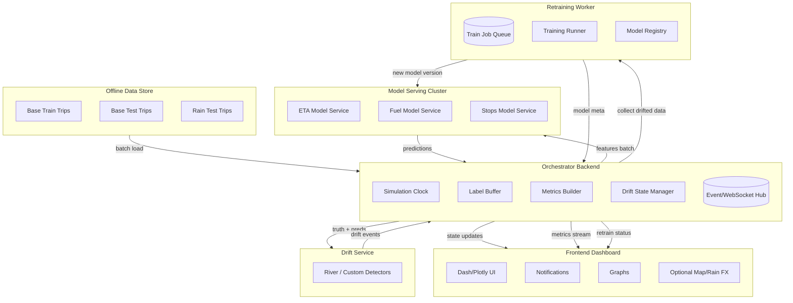
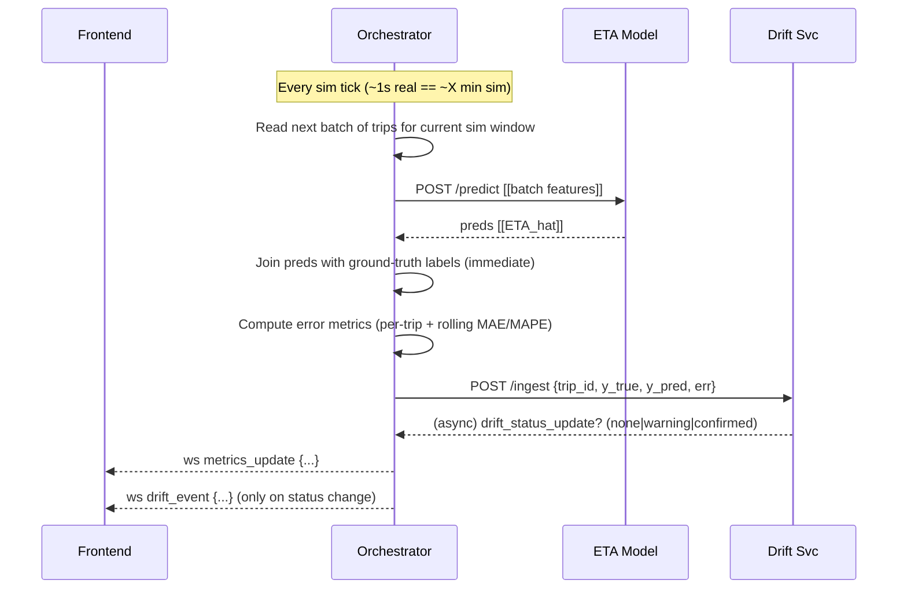
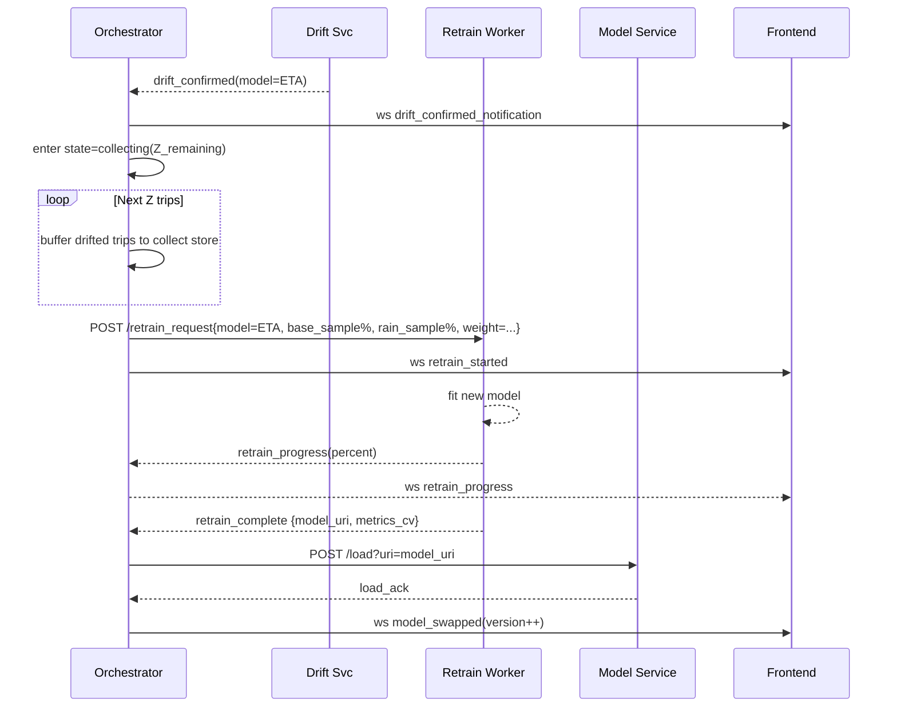

# Platform

## Storyboard
### Phase A - Base
1. Simulation clock starts. Trips stream in temporal order from Base Test dataset (~10h simulated).
1. Models (trained on Base Train data) score each trip. Ground truth available immediately (demo shortcut) → errors computed.
1. Dashboard shows low, stable errors (MAE, MAPE) per task.
1. System state per model = stable.

### Phase B - Rain
1. After 10h mark, the Rain Test dataset begins streaming.
1. Visual cue: notification “Rain conditions detected,” optional rain overlay over map stub.
1. Errors begin to rise because models are miscalibrated for friction change.
1. Drift detector consumes error stream (or preds+truth) in rolling windows.
1. When statistical test crosses warning then confirmed thresholds → UI notification per affected model.
1. System enters collecting state for that model: continue running base model for Z additional trips to accumulate drifted training data & let error trend become visually obvious.

### Phase C - Mitigation
1. Retraining triggered, automatically after Z trips.
2. Backend samples old Base Train data + collected Rain data (optionally weighted) → launches retrain job for the model.
3. While retraining, predictions still come from old model; errors remain high.
4. When retrain completes, model service hot‑swaps. Notification shown.
5. Subsequent predictions use retrained model; errors drop relative to pre‑mitigation Rain phase (but not necessarily down to Base levels).
6. Optional: mid‑Rain second retrain after more data accumulates; show iterative improvement.

## Architecture
### Components Diagram


### Sequence Diagrams
#### Simulation Tick


#### Drift Confirmed → Data Collect → Retrain → Swap


## API
### Prediction Request (Backend -> Model Serving Component)
POST /predict
```
{
  "model_name": "eta",
  "model_version": 1,
  "instances": [
    {"trip_id":"T123", "features": {"hour_bin":8, "distance_m":4523, ...}},
    {"trip_id":"T124", "features": {...}}
  ]
}
```
Response
```
{
  "model_name": "eta",
  "model_version": 1,
  "predictions": [
    {"trip_id":"T123", "y_pred": 301.2},
    {"trip_id":"T124", "y_pred": 512.7}
  ]
}
```

### Drift Ingest (Backend -> Drift Component)
POST /ingest
```
{
  "task": "eta",
  "records": [
    {"trip_id":"T123", "t_sim":3600, "y_true":298.0, "y_pred":301.2},
    {"trip_id":"T124", "t_sim":3605, "y_true":500.0, "y_pred":512.7}
  ]
}
```

### Drift Status Update (Drift Component -> Backend)
POST /drift_event
```
{
  "task": "eta",
  "status": "confirmed",
  "score": 0.97,
  "t_sim": 3660,
  "n_obs": 2000
}
```

### Retrain Request (Backend -> Retrain Worker)
POST /retrain
```
{
  "task": "eta",
  "base_sample_pct": 0.2,
  "rain_since_t": 36000,
  "weight_rain": 3,
  "output_version": 2
}
```

### WebSocket Events (Backend -> Frontend)
```
{ "type": "tick", "t_sim": 12345, "play_speed": 400 }
{ "type": "metrics", "task":"eta", "t_sim":12345, "mae":5.2, "mape":0.08 }
{ "type": "drift", "task":"eta", "status":"warning", "score":0.7 }
{ "type": "drift", "task":"eta", "status":"confirmed" }
{ "type": "collecting", "task":"eta", "remaining_trips": 800 }
{ "type": "retrain_started", "task":"eta", "version":2 }
{ "type": "retrain_progress", "task":"eta", "pct":42 }
{ "type": "model_swapped", "task":"eta", "version":2 }
```

## Technology Stack
- Backend: FastAPI
- Frontend: Dash Plotly (Dash Leaflet)
- Drift Detection: River
- Model Serving: FastAPI
- Data Store: Parquet
- Messaging: Backend native WebSockets
- Containers: Docker

## Additions
- Drift detection score on Frontend metrics, or at least status (stable, warning, confirmed)
- Rolling window computation same for both drift detection and metrics/errors
- At each tick, append errors, recompute windowed errors, emit metric updates, push points to graphs
- Offline precompute retrained models with simulated training time on the worker
- Skip database integration, read static files, hold in memory slices, log run summary at the end
- Graph background shading turns amber on warning, red on confirmed, blue stripes while retraining, green flash on swap
- Short timestamped notifications like "[10:02:11] ETA drift warning", or "[10:03:30] Collecting 5k rain trips before retrain"
- Static basemap tile (OpenStreetMap) with a bounding box and an overlay of weather icon (sun and rain), or a rain effect

## Prompt
We want to make a platform based around the concept of a drift detection and mitigation process.

We have 3 different machine learning models, one for estimated time of arrival prediction, one for fuel consumption prediction, and one for number of stops prediction. All three of them will most likely end up being gradient boosting regression models, but with different preprocessing steps and features.

We have also generated some SUMO traffic data from Athens center map. One dataset is 10 hours of base train data (which we used to train the models), one dataset is 10 hours of base test data (which we will use on the platform to test the models), and one dataset is 10 hours of rain test data (which is basically a concept drift scenario simulation, where the road friction is reduced from 1.0 to 0.4 to simulate rain, and will be used on the platform to test the models and detect drift).

The data is FCD and Emission output from SUMO in CSV format, for every timestep for every vehicle. We do some preprocessing to get the data in a trip format, where we only keep the source and destination coordinates, the hour bin where the trip started (we have hourly varied traffic generation volumes, so it should be an important feature), the distance traveled and some more features, different per model. There are around 55k trips in each dataset, and each model has around 10-20 features.

We will use the base test data and then the rain test data, one after the other and have the models predict on those trips. This will be done in a sped up fashion, in something like a timelapse, for example the whole 20 hours of data will be compressed into 2-3 mins of timelapse. This is for demonstration purposes, to show the concept drift and the mitigation process in a reasonable time.

There is an idea to have a small map with the simulation area of Athens center, and have a percentage of the current cars being shown in the map, following their routes. However, based on the fact that the 20 hours will be compressed into 2-3 mins or something in that order, and that the average trip duration in the datasets is 3-5 minutes, each trip will be compressed into around 1 second of timelapse. Therefore, this idea doesn't sound too feasible, or worth it, since its trip will be shown for a very short time, and the between positions and routes that will have to be calculated and shown will be computationally heavy on the Frontend and on the communications, and introduce extra engineering and logic and orchestration.

Other than that, we will have graphs to monitor the performance of the models, and if possible these can be dynamically filled in, as the timelapse progresses, every second or so, and accompanied by labels with the metrics written out, everytime a value is calculated and added to the graphs. For example, since we have 3 different models/ML tasks, we can have a total of 6 different graphs that show the MAE and the MAPE of each model, plus some labels for the latest metrics calculated.

At some point after the 10 hours of base test data ends, the day will change, and the rain scenario will begin. This should send a notification to the user, and if we have the map or something similar as a visual, a rain effect can be added to it. Then, as the predictions continue with the base models on the drifted rain data, the graphs will show higher errors than before. Then, we will have a drift detection mechanism, that will be receiving either the raw predictions and expected values and calculating errors itself, or the errors of the models as they are being sent to the graphs as well, and will detect drift based on the errors. This will happen independently for each model, and for each drift detection, there should be a notification that drift has been detected for that model. Another idea is to have a notification when the confidence is increasing, as a drift warning notification, before it is actually confirmed, but I'm not sure if there is such a thing as confidence increasing when detectors are used.

After the drift detection happens for a model, and the relevant notifications/visuals are shown, we will wait for some time so that the graphs have enough high errors calculated and shown, and in order to "collect" more drifted rain data, so that we can retrain the model with some old base data and the new "collected" rain data, with maybe higher importance/weights on the new data. However, bare in mind, as is the case with the whole pipeline and platform, we already have all the data we want, we just want to make this somewhat realistic, so in real life, we would have to wait to collect more data before retraining, and that is what we are doing here as well.

After enough data has been collected for a model to retrain, a notification should go out that the model is being retrained as part of the drift mitigation process. The errors, on the meantime should remain high, as we are still predicting with the base model. When retraining is done for a model, it should be swapped in the system, a notification should go out that the retrained model is ready to be used, and it should then continue with the predictions with this new model. The errors should start to fall down a bit, not to the base level, but to a level that is better than the first drifted errors with the base model. There is a possibility that we also retrain at some point later on, when lets say half the rain test data has been predicted/collected, and we have a good amount of data to retrain with, where a similar process to the one described above will happen, considering that the errors are still high, and we want to improve the model performance even more.

We want to keep this in general simple, and not too complex. We don't know if there is a better way to do this, or any other ideas to suggest for improvement or changes. We are mainly using Python, and we will probably use FastAPI for the Backend, Dash Plotly with Dash Leaflet if add a map or any other capable framework for the Frontend that integrates well with Python, River library for the Drift Component together with a FastAPI for the communication, and if needed for a reason, MongoDB or any other Database fit for this purpose. We are open to ideas and to changes to make this more feasible and not extremely complex on an engineering aspect.

The Backend probably is the one responsible for driving the simulation clock and the speed scaling of the timelapse, for sending feature batches to model services in simulation order to predict, for receiving the predictions, matching them to the ground truth, computing the metrics and errors, sending them to the Frontend and to the Drift Component (either the raw predictions or the errors), managing the drift state for the 3 models (stable > warning > confirmed > collecting > retraining > post retrain), emitting websocket events to Frontend (tick, metrics update, drift event, retrain status, day transition for drift, etc), providing rest endpoints for run control (start, pause, restart, jump-to-timestamp, set playback speed), etc. These are all ideas and thoughts and can be reduced, modified or removed if not necessary.

The models will be served on the Model Serving Components running FastAPI and Uvicorn or any other capable framework, that will load the model weights from the Database and also run the code for the preprocessing steps, and serve some endpoints, like /predict and /retrain, and maybe /status for training progress, or /load to load model weights. The Backend will be orchestrating the whole process, and the Frontend will be a simple dashboard with the graphs and metrics, the notifications, and maybe a small map with the rain effect or any other visual we might think of, maybe even a mocked map as to not have to compute exact routes and positions, just for the effect. If used, the Database could possibly store the model weights, if not on filesystem, the predictions made if needed for reference, and the metrics and graphs calculated for these predictions, if needed again, and the data (both base and rain, either raw or on a common trip format that we use on predictions), if these are not read from the filesystem, or in any other way.

The Drift Component will detect the drift with a rolling window of X trips or data points, calculated every Y trips, based on the errors of the predictions. As previously mentioned, it will either receive the raw predictions and expected values and calculate the errors itself, or the errors of the models as they are being sent from the Backend to the Frontend for the metrics and graphs as well. When drift is detected, the base model will be allowed to predict for Z trips more, in order for the graphs to be updated with the higher errors, and for the new drifted rain data to be "collected". Then, after the Z trips have passed/been predicted, it will request the retraining of the model with some old base data and the new collected drift rain data.

As a note, we could optionally precompute the predictions for deterministic demo fallback, if live model servers are misbehaving.

Another note, is the raw data/trips could be bucketed into batches, like 5 min bins or so, so they are predicted in batches, based on the simulation clock and how frequently we are updating the graphs, etc.

Finally, the ground truth should be considered as available immediately, and not in the future, so we can use it instantly to calculate the errors, even though this is not realistic.

For a general orchestration, using Docker is a good idea, with various containers for all the components, and possibly a docker compose file to run the whole platform. But if there is another better or simper way to do this, let me know.

Give me a good plan for this, the architecture, the components, their roles, what communications will go on, how it will be orchestrated, what tools to actually use, since I'm open to suggestions, and if its feasible to do this with the tools suggested, other ideas for changes or improvements, ideas for visuals, etc. Get technical because I need it to make sure this is possible to do, and there are tools to do it, so be detailed, without becoming too complex or over engineering it.

This is an overview of a platform I wrote. I need you to read it, understand it, process it, solve any problems/questions etc, and then help me present this to my supervisors. I'd possibly like some diagrams, like a component diagram with the communications noted, some sequence diagrams, a general plan for the architecture and even written text as an overview or I dont know what. You know better. Give me what Im asking for, but keep in mind that the goal is to do something that is worth it, isn't extremely complex since we are undergraduate students doing this for our master or diploma thesis, but keeps a level of realism with some room for future improvements.

